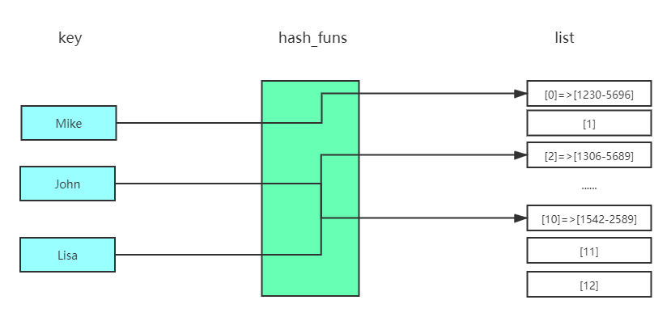
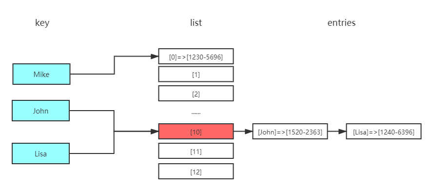

# 算法介绍

> 这里记录学习《算法图解》的笔记。

## 二分法查找

顾名思义，它是一种算法，从一个有序的列表中查找目标元素，使用从中间位置开始向目标元素靠近。例如，目标元素在 1-100 的数字中，你从 50 开始猜测，如果小了，就取 50-100 的中间位置继续猜测，则反之。  
一般而言，对于包含 n 个元素的列表，用二分查找最多需要 $\log_2 n$ 步，而简单查找最多需要 n 步。

## 大 O 表示法

随着数据量的不断增加，处理数据的时间是如何变化的，缓慢速度增加、平均速度增加、快速增加等等。（操作数也多，说明用时越长。）

## 选择排序

1. 计算机内存犹如一大堆抽屉。
2. 需要存储多个元素时，可使用数组或链表。
3. 数组的元素都在一起。
4. 链表的元素是分开的，其中每个元素都存储了下一个元素的地址。
5. 数组的读取速度很快。
6. 链表的插入和删除速度很快。
7. 在同一个数组中，所有元素的类型都必须相同（都为 int、double 等）。

## 递归

1. 递归指的是调用自己的函数。
2. 每个递归函数都有两个条件：基线条件和递归条件。
3. 栈有两种操作：压入和弹出。
4. 所有函数调用都进入调用栈。
5. 调用栈可能很长，这将占用大量的内存。

**提示：编写涉及数组的递归函数时，基线条件通常是数组为空或只包含一个元素。陷入困境时，
请检查基线条件是不是这样的。**

## 快速排序

1. 快速排序将问题逐步分解。使用快速排序处理列表时，基线条件很可能是空数组或只包含一个元
素的数组。
2. 实现快速排序时，请随机地选择用作基准值的元素。快速排序的平均运行时间为 O(n$\log_2 n$)。
3. 大O表示法中的常量有时候事关重大，这就是快速排序比合并排序快的原因所在。
4. 比较简单查找和二分查找时，常量几乎无关紧要，因为列表很长时，O($\log_2 n$) 的速度比 O(n)
快得多。

## 散列表

散列表即是哈希（hash）表。  
散列/哈希函数：将输入映射到数字（键映射到值）。

通过链表解决哈希冲突

1. 你可以结合散列函数和数组来创建散列表。
2. 冲突很糟糕，你应使用可以最大限度减少冲突的散列函数。
3. 散列表的查找、插入和删除速度都非常快。
4. 散列表适合用于模拟映射关系。
5. 一旦填装因子超过 0.7，就该调整散列表的长度。
6. 散列表可用于缓存数据（例如，在 Web 服务器上）。
7. 散列表非常适合用于防止重复。

## 广度优先搜索

1. 广度优先搜索指出是否有从A到B的路径。
2. 如果有，广度优先搜索将找出最短路径。
3. 面临类似于寻找最短路径的问题时，可尝试使用图来建立模型，再使用广度优先搜索来
解决问题。
4. 有向图中的边为箭头，箭头的方向指定了关系的方向，例如，rama→adit表示rama欠adit钱。
5. 无向图中的边不带箭头，其中的关系是双向的，例如，ross - rachel表示“ross与rachel约
会，而rachel也与ross约会”。
6. 队列是先进先出（FIFO）的。
7. 栈是后进先出（LIFO）的。
8. 你需要按加入顺序检查搜索列表中的人，否则找到的就不是最短路径，因此搜索列表必
须是队列。
9. 对于检查过的人，务必不要再去检查，否则可能导致无限循环。
