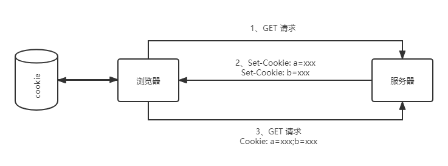

# HTTP 的 Cookie 机制和缓存控制

## 什么是 Cookie

因为 HTTP 是“无状态”的，所以无法支持需要记录状态的操作。如果新闻网站，视频网站或电商网站要对用户进行个性化定制怎么做呢，那么就需要引入外力 Cookie 了。Cookie 像是服务器给浏览器贴上的标签，当服务器看到它，就想起它是谁了。

## Cookie 工作流程

见下图：

## Cookie 的属性

### Cookie 的生存周期