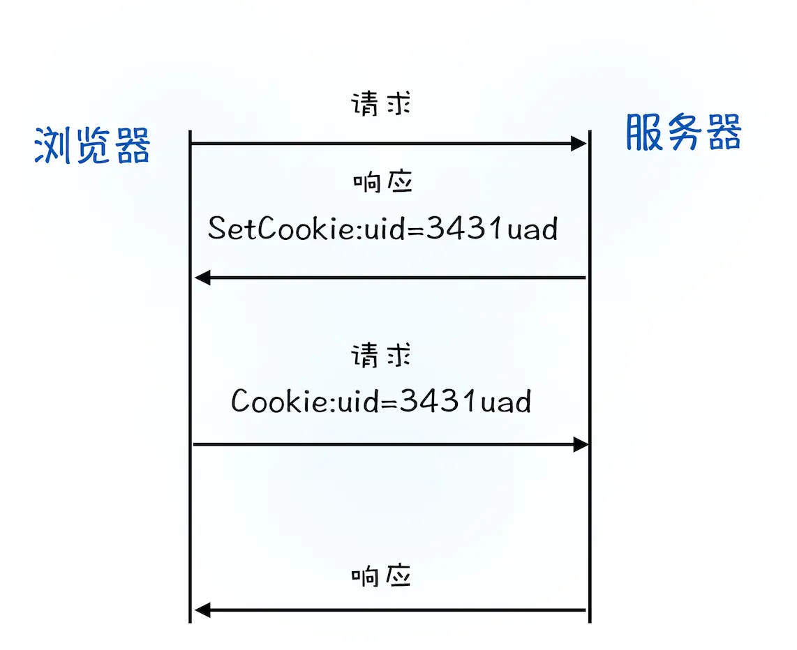
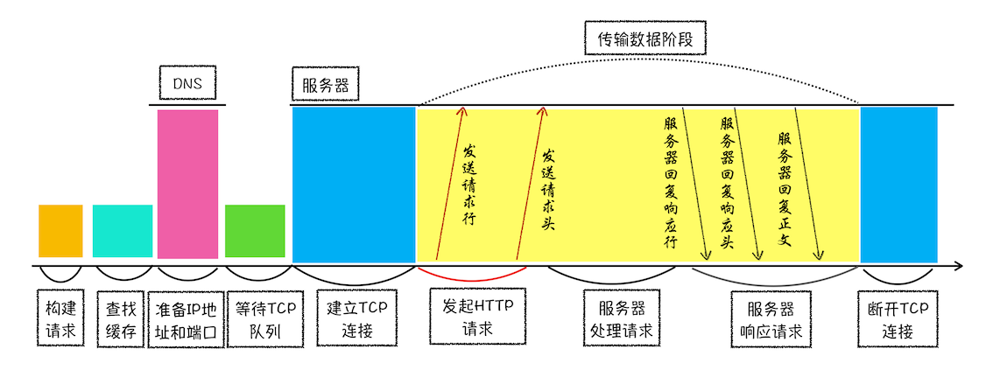

# HTTP 请求流程的简单介绍

## 前言

前端工程师几乎每天都要和浏览器打交道，所以，了解浏览器是如何工作的，能够使我们快速定位问题和提升用户体验。

## HTTP 定义

HTTP 是一种允许浏览器向服务器获取资源的协议，是 Web 的基础，通常由浏览器发起请求，用来获取不同类型的文件，例如 HTML 文件、CSS 文件、JavaScript 文件、图片、视频等。

## 浏览器发起 HTTP 请求

### 构建请求
### 查找缓存

如果浏览器缓存中有该资源文件，就直接使用了。

优点如下：
- 缓解服务器端压力，提升性能。
- 对于网站来说，缓存是实现快速资源加载的重要组成部分。

### 准备 IP 地址和端口
#### 原因

HTTP 协议是建立在 TCP 连接基础之上，所以在 HTTP 工作开始之前，浏览器需要通过 TCP 与服务器建立连接。也就是说 HTTP 的内容是通过 TCP 的传输数据阶段来实现的。

#### 获取 IP

浏览器会请求 DNS 返回域名对应的 IP，当然浏览器还提供了 DNS 数据缓存服务，如果某个域名已经解析过了，那么浏览器会缓存解析的结果。

#### 获取端口

如果 URL 没有指定端口号，那么默认是 80。

### 等待 TCP 队列

Chrome 有个机制，同一个域名同时最多只能建立 6 个 TCP 连接（包含但不限于请求图片、视频，样式，脚本等），如果在同一个域名下同时有 10 个请求发生，那么其中 4 个请求会进入排队等待状态，直至进行中的请求完成。

### 建立 TCP 连接

三次握手。

### 发送 HTTP 请求

请求数据格式包含如下：
- 请求行：请求方法、请求 URI、HTTP 版本协议。
- 请求头：比如包含了浏览器所使用的操作系统、浏览器内核等信息，以及当前请求的域名信息、浏览器端的 Cookie 信息，等等。
- 请求体：例如：POST 请求，发送给后端的数据。

## 服务端处理 HTTP 请求

### 返回请求

数据格式如下：
- 响应行：协议版本和状态码。
- 响应头：比如服务器生成返回数据的时间、返回的数据类型（JSON、HTML、流媒体等类型），以及服务器要在客户端保存的 Cookie 等信息。
- 响应体：通常响应体就包含了 HTML 的实际内容。

状态码如下：
- 信息响应 100-199
- 成功响应 200-299
- 重定向 300-399
- 客户端错误 400-499
- 服务器错误 500-599

### 断开连接

浏览器或服务器其头信息加入 Connection:Keep-Alive，那么 TCP 连接在发送后将仍然保持打开状态。这样做有什么好处呢？保持 TCP 连接可以省去下次请求时需要建立连接的时间，提升资源加载速度。

### 重定向

## 为什么很多站点第二次打开速度会很快？

## 登录状态是如何保持的？

## 总结

这是学习[《浏览器工作原理与实践》](https://time.geekbang.org/column/intro/216)李兵老师课程的笔记。