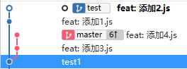
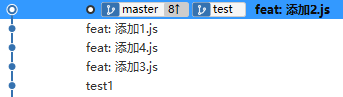
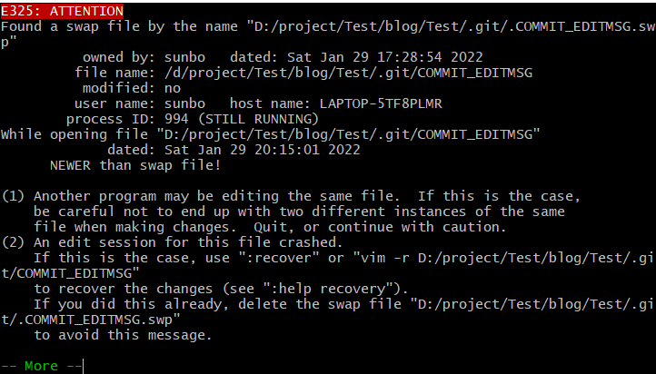
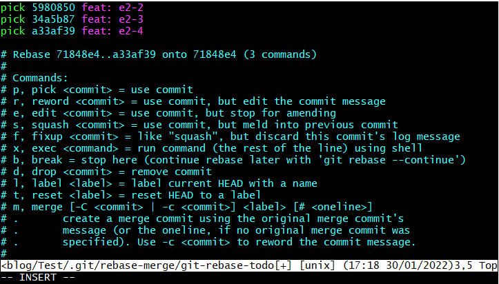
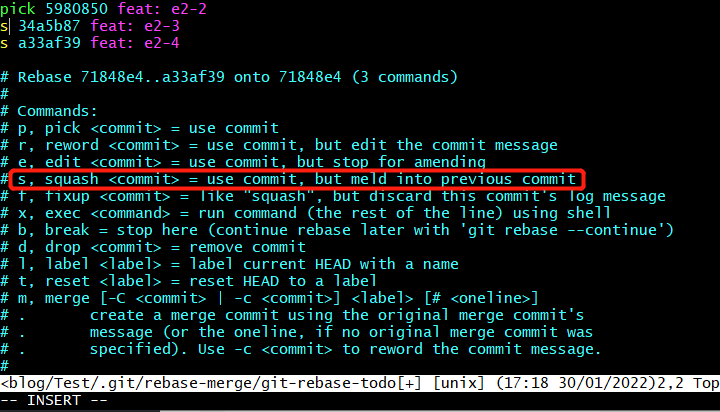
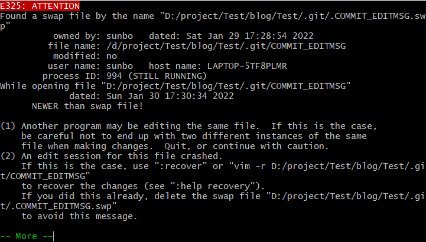

# Git 实战技巧

在日常开发中，Git 对我们的代码管理起到重要作用。因此作为开发人员都要掌握使用它的技巧。

## Git 的工作区域和流程

见下图：


workspace：工作区，就是平时进行开发改动的地方，是当前看到最新的内容，在开发的过程也就是对工作区的操作。

Index：暂存区，当执行 `git add` 的命令后，工作区的文件就会被移入暂存区，暂存区标记了当前工作区中那些内容是被 Git 管理的，当完成某个需求或者功能后需要提交代码，第一步就是通过 `git add` 先提交到暂存区。

Repository：本地仓库，位于自己的电脑上，通过 `git commit` 提交暂存区的内容，会进入本地仓库。

Remote：远程仓库，用来托管代码的服务器，远程仓库的内容能够被分布在多个地点的处于协作关系的本地仓库修改，本地仓库修改完代码后通过 `git push` 命令同步代码到远程仓库。

Git 的常规操作：

1. 在工作区开发，修改和添加文件；
2. 将修改后的文件放入暂存区；
3. 将暂存区的文件提交到本地仓库；
4. 将本地仓库的修改推送到远程仓库；

## Git 基本技巧

1. `git add` 将文件放入暂存区
```sh
# 添加当前所有修改文件至暂存区
$ git add .
```

2. `git commit` 将暂存区的更改文件提交至本地仓库
```sh
# 等价于 git add . 和 git commit -m。注意：对新文件不受影响
$ git commit -am '提交至本地仓库'
```

3. `git pull` 将远程仓库代码拉取合并到本地仓库，等同于 `git fetch + git merge`
```sh
# 等同于 git fetch + git rebase(变基)
$ git pull --rebase
```

4. `git fetch` 与 `git pull` 不同的是 `git fetch` 操作仅仅只会拉取远程的更改，不会自动进行 `merge` 操作。对你当前的代码没有影响
```sh
# 拉取特定分支
$ git fetch <远程主机名> <分支名>

# 拉取远程主机所有分支
$ git fetch --all
```

5. `git branch` 分支
```sh
# 新建本地分支，但不切换
git branch <branch-name>

# 查看本地分支
git branch

# 查看远程分支
git branch -r

# 查看本地和远程分支
git branch -a

# 删除本地分支
git branch -D <branch-nane>

# 重新命名分支
git branch -m <old-branch-name> <new-branch-name>
```

## Git 工作使用

### git rebase

rebase 译作为变基，作用和 merge 类似，用于把分支修改合并到当前分支上。

举个例子：

现在有 2 个分支，分别是 master 和 test 分支，它们都是基于 test1 提交检出的分支。在 master 分支上分别提交两个文件 `3.js` 和 `4.js`，test 分支上分别提交两个文件 `1.js` 和 `2.js`。它们的提交记录截图如下：




在 test 分支上执行 `git rebase master` 命令，可以看到先是逐个应用了 master 分支的更改，然后以 master 分支最后的提交作为基点，再逐个应用 test 的每个更改。最后切换到 master 分支上，执行合并后得到下面记录截图：



上面的例子还是比较简单的，如果在变基时遇到代码冲突，我们需要依次使用 `git add`、`git rebase --continue` 的方式来处理冲突，完成 rebase 的过程，如果不想要某次 rebase 的结果，那么需要使用 `git rebase --skip` 来跳过这次 rebase 操作。

解决冲突后，运行 `git rebase --continue` 会出现下面的 `vim` 界面：



然后键入 `:E` 进入编辑模式，如果需要修改提交文案，可以键入 `i`，`delete` 是删除文案键，更新文案完成后，键入 `esc` 退出编辑模式，最后键入 `:wq` 保存并退出。

`git merge` 在不是 `fast-forward`（快速合并）的情况下，会产生一条额外的合并记录，类似 `Merge branch 'xxx' into 'xxx'` 的一条提交信息。另外，在解决冲突的时候，用 merge 只需要解决一次冲突即可，简单粗暴，而用 rebase 的时候 ，需要依次解决每次的冲突，才可以提交。

### `git rebase -i`

在开发中，如果遇到多个无效提交想将它们压缩成一次提交，需要使用命令 `git rebase -i <base-commit>`，其中 `<base-commit>` 是提交的 id，以它作为起点，把后面的提交压缩（不包含起点），然后会进入 vim 的交互式界面：



我们要使用 Squash 策略进行合并，但至少保留一个 pick，否则命令会执行失败。



退出编辑模式，然后键入 `:wq` 保存并推出，此时又会出现另一个界面。



键入 `:E` 进入编辑模式，将更改合并提交的文案，最后再 `:wq` 保存并退出。

::: warning 注意
特别注意，只能在自己使用的 test 分支上进行 rebase 操作，不允许在集成分支上进行 rebase，因为这种操作会修改集成分支的历史记录。
:::

## 参考文献

- [git 官方文档](https://www.git-scm.com/docs)
- [我在工作中是如何使用 git 的](https://juejin.cn/post/6974184935804534815)