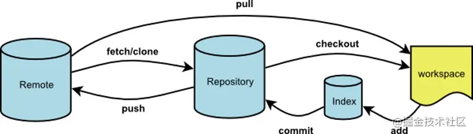

# Git 实战技巧

在日常开发中，Git 对我们的代码管理起到重要作用。因此作为开发人员都要掌握使用它的技巧。

## Git 的工作区域和流程

见下图：



workspace：工作区，就是平时进行开发改动的地方，是当前看到最新的内容，在开发的过程也就是对工作区的操作。

Index：暂存区，当执行 `git add` 的命令后，工作区的文件就会被移入暂存区，暂存区标记了当前工作区中那些内容是被 Git 管理的，当完成某个需求或者功能后需要提交代码，第一步就是通过 `git add` 先提交到暂存区。

Repository：本地仓库，位于自己的电脑上，通过 `git commit` 提交暂存区的内容，会进入本地仓库。

Remote：远程仓库，用来托管代码的服务器，远程仓库的内容能够被分布在多个地点的处于协作关系的本地仓库修改，本地仓库修改完代码后通过 `git push` 命令同步代码到远程仓库。

Git 的常规操作：

1. 在工作区开发，修改和添加文件；
2. 将修改后的文件放入暂存区；
3. 将暂存区的文件提交到本地仓库；
4. 将本地仓库的修改推送到远程仓库；

## Git 基本技巧

1. `git add` 将文件放入暂存区
```sh
# 添加当前所有修改文件至暂存区
$ git add .
```

2. `git commit` 将暂存区的更改文件提交至本地仓库
```sh
# 等价于 git add . 和 git commit -m。注意：对新文件不受影响
$ git commit -am '提交至本地仓库'
```

3. `git pull` 将远程仓库代码拉取合并到本地仓库，等同于 `git fetch + git merge`
```sh
# 等同于 git fetch + git rebase(变基)
$ git pull --rebase
```

4. `git fetch` 与 `git pull` 不同的是 `git fetch` 操作仅仅只会拉取远程的更改，不会自动进行 `merge` 操作。对你当前的代码没有影响
```sh
# 拉取特定分支
$ git fetch <远程主机名> <分支名>

# 拉取远程主机所有分支
$ git fetch --all
```

5. `git branch` 分支
```sh
# 新建本地分支，但不切换
git branch <branch-name> 

# 查看本地分支
git branch

# 查看远程分支
git branch -r

# 查看本地和远程分支
git branch -a

# 删除本地分支
git branch -D <branch-nane>

# 重新命名分支
git branch -m <old-branch-name> <new-branch-name>
```

## Git 工作使用

### git rebase

## 参考文献

- [git 官方文档](https://www.git-scm.com/docs)
- [我在工作中是如何使用 git 的](https://juejin.cn/post/6974184935804534815)