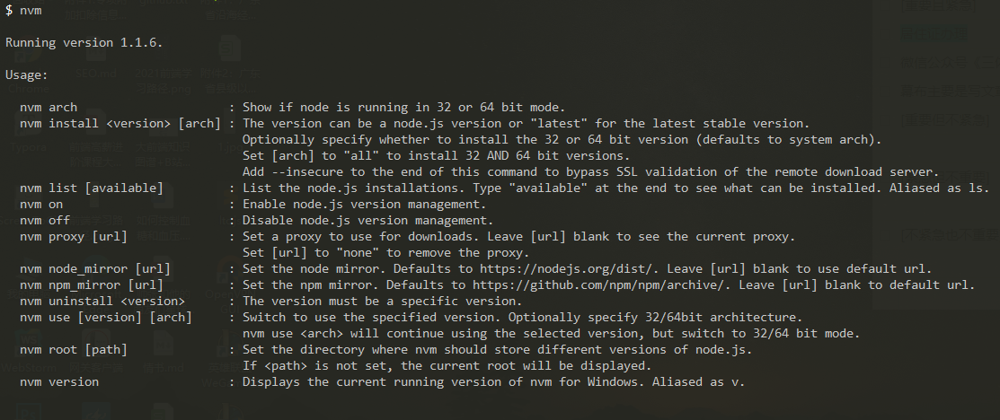

# NVM 的安装和使用

## 前言

现在想象一个场景，如果你有 2 个项目，它们分别依赖不同的 `Node.js` 版本环境，或者你需要使用新版的 `Node.js` 进行实验和学习，那么就需要一个管理 `Node.js` 的版本工具，而这就是 `nvm` 存在的价值。

`nvm` 允许你使用命令行方式快速安装和使用不同版本的 `Node.js`。

下面我将介绍如何安装和使用 `nvm`，本人电脑是 `win10 64` 位操作系统。

## 安装

如果你电脑之前有安装过 `Node.js`，请卸载后再安装 `nvm`，建议将环境变量里配置的 `node_path` 缓存全局模块路径也删掉。[卸载参考资料](https://blog.csdn.net/qq_40968685/article/details/106279002)

关于安装[nvm](https://github.com/coreybutler/nvm-windows/releases)版本，我这里选择了 `1.1.6`，因为我最开始安装 `1.1.9` 时，发现使用命令 `nvm use xxx` 会报错，查阅 [issue#708](https://github.com/coreybutler/nvm-windows/issues/708) 得知后面作者会修复。

下载好安装程序（`nvm-setup.zip`），解压后双击进行安装，过程中有两处地方需要选择安装路径，**注意路径不能有空格或中文**，一个是 `nvm`，另一个是 `Node.js`。[安装过程参考资料](https://www.jianshu.com/p/d0e0935b150a)

由于国内网络访问慢，因此需要对 `nvm` 的下载源添加下淘宝镜像，在 `nvm` 安装目录找到 `settings.txt` 文本。[参考资料](https://segmentfault.com/a/1190000023716452)
```
node_mirror: https://npm.taobao.org/mirrors/node/
npm_mirror: https://npm.taobao.org/mirrors/npm/
```

## 使用

完成上面的安装流程后，先检验一下是否安装成功。
```sh
$ nvm
```
成功结果图如下：


```sh
# 会提示 nvw 下的相关命令
$ nvm

# 查看已安装 node 版本
$ nvm ls

# 安装最新版本 nvm
$ nvm install
nvm install vXX      // 安装对应 vXX 版本的 node
nvm uninstall vXX    // 卸载对应 vXX 版本的 node
nvm use xxx          // 选择使用XXX版本
num list             // 查看本地已安装的版本
nvm list available   // 查看所有版本
NVM常用命令
nvm list installed   // 查看已经安装的版本
nvm list available   // 查看网络可以安装的版本
nvm version          // 查看当前的版本
nvm use <version>    // 切换使用指定的版本node
nvm current          // 显示当前版本
nvm alias <name> <version> ## 给不同的版本号添加别名
nvm unalias <name> ## 删除已定义的别名
nvm reinstall-packages <version> ## 在当前版本node环境下，重新全局安装指定版本号的npm包
nvm on 打开nodejs控制
nvm off 关闭nodejs控制
nvm proxy 查看设置与代理
nvm node_mirror [url] 设置或者查看setting.txt中的node_mirror，如果不设置的默认是 https://nodejs.org/dist/
nvm npm_mirror [url] 设置或者查看setting.txt中的npm_mirror,如果不设置的话默认的是： https://github.com/npm/npm/archive/.
nvm uninstall <version> 卸载制定的版本
nvm use [version] [arch] 切换制定的node版本和位数
nvm root [path] 设置和查看root路径
```

### 安装 `Node.js` 版本

```sh
$ nvm install 12.22.10
```

附带的 `npm` 包可能会下载失败，这时候可以单独去 `npm` 官网找对应的版本下载（文末贴出了参考链接），然后将它解压到 `D:\nvm\nvm\v12.22.10\node_modules`，接着把解压后的文件夹名称改为 `npm`，接着把 `D:\nvm\nvm\v12.22.10\node_modules\npm\bin` 目录下面 4 个文件拷贝下，分别是 `npm/npx file` 和 `npm/npx .cmd file`，拷贝到目录 `D:\nvm\nvm\v12.22.10`。

通过如下命令检测：
```sh
nvm use 12.22.10
node -v
npm -v
```

### 配置全局模块安装路径

#### 查看当前 npm 包的全局安装路径
```sh
$ npm prefix -g
```

#### 查看当前 npm 包的全局 cache 路径
```sh
$ npm config get cache
```

#### 修改 npm 的包的全局安装路径

首先在对应路径创建文件夹 `nodejs` 和 `node_global`
```sh
$ npm config set prefix "D:\nodejs\node_global"
```

#### 修改 npm 的包的全局 cache 位置

首先在对应路径创建文件夹 `nodejs` 和 `node_cache`
```sh
$ npm config set cache "D:\nodejs\node_cache"
```

#### 环境变量配置

`此电脑 -> 属性 -> 高级系统设置 -> 环境变量 -> 系统变量 -> path -> 编辑 -> 新增路径-D:\nodejs\node_global`（路径可以根据 `npm prefix -g` 查看）

::: warning 注意
每次使用 nvm 切换 node 版本，最好都查看一下 npm 全局配置路径是否失效。
:::

## 参考文献

- [nvm](https://github.com/nvm-sh/nvm#important-notes)
- [nvm-windows](https://github.com/coreybutler/nvm-windows)
- [nvm-windows-releases](https://github.com/coreybutler/nvm-windows/releases)
- [NPM github repo is moving from npm/npm to npm/cli and it causes NVM to fail to install it](https://github.com/coreybutler/nvm-windows/issues/373)
- [npm 手动下载](https://github.com/npm/cli/releases)
- [查阅 nodejs 与 npm 匹配版本](https://nodejs.org/en/download/releases/)
- [npm-v6.14.16](https://github.com/npm/cli/releases/tag/v6.14.16)
- [npm-v8.3.1](https://github.com/npm/cli/releases/tag/v8.3.1)
- [通过 nvm 安装 Node.js 与统一的全局模块安装路径的配置](https://juejin.cn/post/6946594249093677069)
- [mirror-config-china](https://www.npmjs.com/package/mirror-config-china)