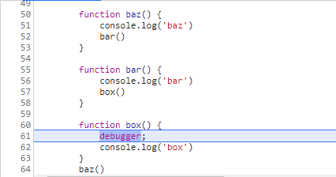
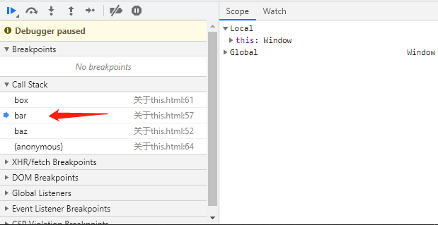

# 关于 this
## this 是什么

举个例子：
```js
function foo (num) {
    console.log('foo：' + num)
    this.count++
}
foo.count = 0

for (var i = 0; i < 10; i++) {
    if (i > 5) {
        foo(i)
    }
}

// foo: 6
// foo: 7
// foo: 8
// foo: 9

console.log(foo.count) // 0
```

分析：从 foo 函数输出的 4 条记录来看，foo 函数的确被执行了 4 次，但是 foo.count 输出的结果居然是 0。在执行 foo.count = 0 时，已经向函数对象 foo 添加了属性 count，但是函数内部代码 this.count 中的 this 并不指向函数对象，所以 foo.count 才会输出 0。

结论：this 的绑定和函数声明的位置没有任何关系，只取决于函数的调用方式。

扩展：当一个函数被调用时，会创建一个活动记录（执行上下文）。这个记录会包含函数在哪里调用（调用栈）、函数的调用方式、传入的参数信息。this 就是这个记录的一个属性，会在函数执行的过程中用到。

既然 this 的指向和函数的调用位置有关，那么在开发的时候如何判断呢？我们使用日常开发的调试工具 Chrome 浏览器来查看下。

举个例子：
```js
function baz () {
    console.log('baz')
    bar()
}

function bar () {
    console.log('bar')
    box()
}

function box () {
    debugger; // 断点
    console.log('box')
}

baz()
```

查看浏览器截图如下：




从调用栈列表中我们分析出 box 函数的调用位置是在 bar 这里。  
**分析调用栈（就是为了到达当前执行位置所调用的所有函数）。真正的调用位置就在当前正在执行的函数的前一个调用中。**

## this 绑定规则

### 默认规则

这是最常用的函数调用类型：独立函数调用。可以把这条规则看作是无法应用其他规则时的默认规则。

举个例子：
```js
// demo1
function foo1 () {
    console.log(this.name1)
}

var name1 = 'bar'

foo1() // bar

// demo2
function foo2 () {
    "use strict"

    console.log(this.name2)
}

var name2 = 'bar'

foo2() // TypeError: this is undefined

// demo3
function foo3 () {
    console.log(this.name3)
}

var name3 = 'bar'

(function () {
    "use strict"
    
    foo3() // bar
})()
```

分析：在全局作用域声明的变量就是全局对象的一个属性。因此 this.name 的 this 指向全局对象。  
如果函数**运行**在严格模式（demo2），则不能将全局对象用于默认绑定，因此 this 会绑定到 undefined，而在严格模式下**调用**则不影响 `foo3()` 函数的默认绑定。换句话说，决定 this 绑定对象的并不是调用位置是否处于严格模式，而是函数体是否处于严格模式，如果函数体处于严格模式，那么 this 就会被绑定到 undefined，否则就被绑定到全局对象。

::: warning 注意
日常开发的时候，不应该将严格模式和非严格模式混合使用。整个程序要么严格要么非严格。
:::

### 隐式绑定

这是调用位置是否有上下文对象，或者说是否被某个对象拥有或者包含。

举个例子：
```js
function foo () {
    console.log(this.name)
}

var obj = {
    name: 'bar',
    foo: foo
}

obj.foo() // bar
```

分析：调用位置会使用 obj 上下文来引用函数，因此你可以说函数被调用时 obj 对象 “拥有” 或 “包含”函数引用。所以这里的 this 会使用隐式绑定到 obj 上下文对象上。

举个例子：
```js
function foo () {
    console.log(this.name)
}

var obj1 = {
    name: 'bar1',
    foo: foo
}

var obj2 = {
    name: 'bar2',
    obj1: obj1
}

obj2.obj1.foo() // bar1
```

分析：对象属性引用链中只有上一层或者说最后一层在调用位置中起作用。

举个例子：
```js
function foo () {
    console.log(this.name)
}

function doFoo (fn) {
    fn()
}

var obj = {
    name: 'bar',
    foo: foo
}

var name = 'global bar'

doFun(obj.foo) // global bar
```

分析：fn 参数是 obj.foo 的一个引用，它引用的是 foo 函数本身，再来看 `fn()` 此时的调用位置是在 doFoo 调用栈里，所以当前调用位置是全局作用域，此时 this 被绑定到全局对象上了。

### 显式绑定

`call()` 和 `apply()` 方法的第一个参数是一个**对象**，是给 this 准备的，接着在调用函数时将其绑定到 this。因此可以直接指定 this 的绑定对象，我们称为显式绑定。

举个例子：
```js
function foo () {
    console.log(this.name)
}

var obj = {
    name: 'bar'
}

foo.call(obj) // bar
```

分析：通过 `foo.call()`，我们可以在调用 foo 时强制把它的 this 绑定到 obj 上。这里使用 `foo.apply()` 也可以达到一样的结果，它们的区别是其他参数上。

::: tip 提示
如果你传入一个原始值（String、Boolean或Number）来当作 this 的绑定对象，这个原始值会被转换成它的对象形式（`new String()`、`new Boolean()`或`new Number()`），这称为基本包装类型的对象。
:::

#### 硬绑定

举个例子：
```js
function foo () {
    console.log(this.name)
}

var obj = {
    name: 'bar'
}

function baz () {
    foo.call(obj)
}

baz() // bar
setTimeout(baz, 100) // bar

baz.call(window) // bar
```

分析：创建了函数 `baz()`，并在它的内部手动调用了 `foo.call(obj)`，因此强制把 foo 的 this 绑定到了 obj。不管 baz 函数怎么被调用，foo 的 this 总会绑定到 obj 上。这种绑定是一种显示的强制绑定，因此称为硬绑定。

#### 硬绑定应用场景

一、典型的就是创建一个包裹函数，负责接收参数并返回值：
```js
function foo () {
    console.log(this.a, b)
    return this.a + b
}

var obj = {
    a: 2
}

function bar () {
    return foo.apply(obj, arguments)
}

var baz = bar(3)
console.log(baz) // 5
```

二、创建一个可以重复使用的辅助函数：
```js
function foo (b) {
    console.log(this.a, b)
    return this.a + b
}

var obj = {
    a: 2
}

function bind (fn, obj) {
    return function () {
        return fn.apply(obj, arguments)
    }
}

var bar = bind(foo, obj)
var res = bar(3)

console.log(res) // 5
```

由于硬绑定是一种非常常用的模式，所以 ES5 内置了 bind 方法。它的用法如下：
```js
function foo (b) {
    console.log(this.a, b)
    return this.a + b
}

var obj = {
    a: 2
}

var bar = foo.bind(obj)
var res = bar(3)

console.log(res) // 5
```

### new 绑定

通过 new 调用的函数，我们称之为构造函数调用。使用 new 来调用函数会自动执行下面的操作：

1. 创建（或者说构造）一个全新的对象。
2. 这个新对象会被执行 `[[Prototype]]` 连接。
3. 这个新对象会绑定到函数调用的 this。
4. 如果函数没有返回其他对象，那么 new 表达式中的函数调用会自动返回这个新对象。

举个例子：
```js
function foo (name) {
    this.name = name
}

var bar = new foo('huitoutunao')
console.log(bar.name) // huitoutunao
```

分析：使用 new 来调用 `foo()` 时，会构造一个新对象并把它绑定到 `foo()` 调用中的 this 上。

### 优先级

上面介绍了四条绑定 this 的规则，如果某个调用位置满足这四条规则的条件，该怎么办呢？

不用担心，它们是有使用优先级的，排序为：new 绑定 > 显示绑定 > 隐式绑定 > 默认绑定。

如果将 null 或 undefined 作为 this 的绑定对象传入 call、apply 或 bind，这些值在调用时会被忽略，此时应用的是默认绑定规则。

然而，总是使用 null 来忽略 this 绑定可能会产生一些副作用。例如：第三方库的某个函数上使用了 this，而你使用 null 来忽略 this 绑定，此时就会把它绑定到全局对象上，结果可能是修改全局对象。

为了避免上述问题，推荐创建一个空对象（`Object.create(null)`）来代替 null，举个例子：
```js
function foo (a, b) {
    console.log(a, b)
}

var $null = Object.create(null)

foo.apply($null, [1, 2]) // 1, 2
```

### 软绑定

实现默认绑定除了全局对象和 undefined 以外的值，以及保留隐式绑定或显示绑定的能力。**解决了硬绑定没有的灵活性**。
```js
if (!Function.prototype.softBind) {
    Function.prototype.softBind = function (obj) {
        var fn = this // 这里的 this 和 bound 函数里面的 this 指向不同对象。这里是指调用 softBind() 的对象。
        var curried = [].slice.call(arguments, 1) // 因为规定第一个必须传入对象，所以从参数的第二个开始截取。

        // 闭包
        var bound = function () {
            var _this = null
            var args = curried.concat.apply(curried, arguments)

            // 实现默认绑定除了全局对象和 undefined 以外的值，以及保留隐式绑定或显示绑定的能力。
            if (!this || this === (window || global)) {
                _this = obj
            } else {
                _this = this
            }

            return fn.apply(_this, args)
        }

        bound.prototype = Object.create(fn.prototype)
        return bound
    }
}

function foo () {
    console.log('name：' + this.name)
}

var obj1 = {
    name: '小明'
}
var obj2 = {
    name: '小米'
}
var obj3 = {
    name: '小红'
}

// 默认绑定
var fooBindJ = foo.softBind(obj1)
fooBindJ() // 小明

// 隐式绑定
obj2.foo = foo.softBind(obj1)
obj2.foo() // 小米

// 显示绑定
fooBindJ.call(obj3) // 小红
```

## this 词法

ES6 新增了一种无法使用上述四种规则的特殊函数：箭头函数（`=>`）。它是根据外层（函数或者全局）作用域来决定 this。

举个例子：
```js
function foo () {
    return (a) => {
        console.log(this.a)
    }
}

var obj1 = {
    a: 2
}

var obj2 = {
    a: 3
}

var bar = foo.call(obj1)
bar.call(obj2) // 2
```

分析：由于 `foo()` 的 this 被绑定到 obj1 上了，所以 bar（返回的箭头函数）的 this 也会绑定到 obj1 上，而且箭头函数的绑定无法修改，new 也不行！

用途：常用于回调函数中，例如事件或定时器。

## 结语

在学习 JavaScript 基础中，关于 this 部分比较难以理解，同时也是最重要的内容，所以为了使自己能够对 this 这块知识体系的理解更加深入，写下了这篇文章总结。希望对你们也有所帮助。

以上内容都是我参考阅读《你不知道的JavaScript》中，关于 this 解析所整理出来的文章总结。