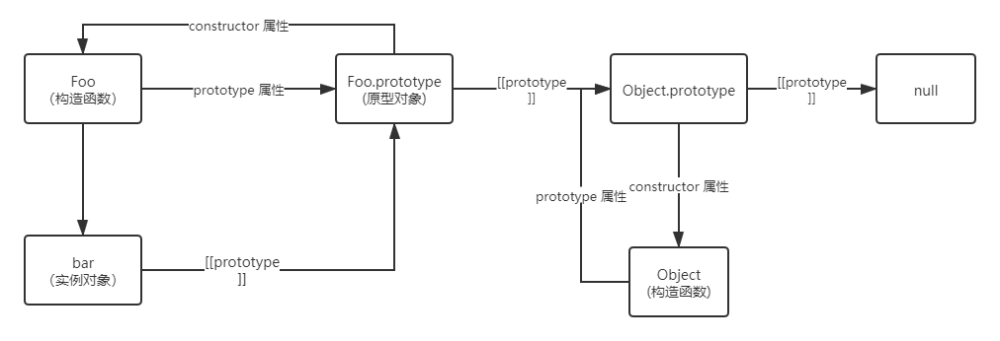

# 原型和原型链

## [[Prototype]]

JavaScript 中每个对象都有个 `[[Prototype]]` 内置属性，而它就是关联其他对象的引用。如果对象本身没有找到需要的属性，那么就会继续访问对象的 `[[Prototype]]` 链。

举个例子：
```js
var foo = {
    v: 1
}

var bar = Object.create(foo) // 创建 bar 和 foo 关联

console.log(bar.v) // 1
```

分析：因为 bar 对象的 `[[Prototype]]` 关联到了 foo，所以 bar 对象本身没有 v 这个属性，也可以通过 `[[Prototype]]` 链查找到。但是，如果 foo 对象上也找不到 v 属性，那么会沿着 `[[Prototype]]` 链继续查找匹配的属性，直到查找完整条原型链。

## 构造函数创建对象

> 所有函数默认都会有一个名为 prototype 的公有且不可枚举的属性，它会指向另一个对象，这个对象通常称为某函数原型，因为我们通过该函数属性 prototype 引用来访问。

举个例子：
```js
function Foo (name) {
    this.name = name
}

Foo.prototype // { } 对象
```

通过调用 `new Foo()` 创建的每个对象将最终被 `[[Prototype]]` 链接到 `Foo.prototype` 原型对象上：
```js
function Foo (name) {
    this.name = name
}

var bar = new Foo('Jack')

Object.getPrototypeOf(bar) === Foo.prototype // true
```

## constructor

每个原型默认有一个公有且不可枚举的 `constructor` 属性，这个属性引用的是对象关联的函数。
```js
function Foo (name) {
    this.name = name
}

Foo.prototype.constructor === Foo // true
```

::: warning 注意
如果你创建了一个新对象并替换了函数默认的 prototype 对象引用，那么新对象并不会自动获得 constructor 属性。
:::

举个例子：
```js
function Foo (name) {
    this.name = name
}

Foo.prototype = {
    // ...
}

var bar = new Foo()

bar.constructor === Foo // false
bar.constructor === Object // true
```

分析：对象 bar 本身并没有 `constructor` 属性，所以它会委托 `[[prototype]]` 链上的 `Foo.prototype` 对象，但是这个对象由于被改写了，导致没有默认的 constructor 属性，最后会委托给原型链顶端的 `Object.prototype`。这个对象有 `constructor` 属性，指向内置的 `Object()` 函数。

因此它们的关系图如下：



**其中 `[[prototype]]` 关联的对象就是原型链。**
## 结语

以上内容是参考《你不知道的JavaScript》中，关于原型解析所整理出来的文章总结。