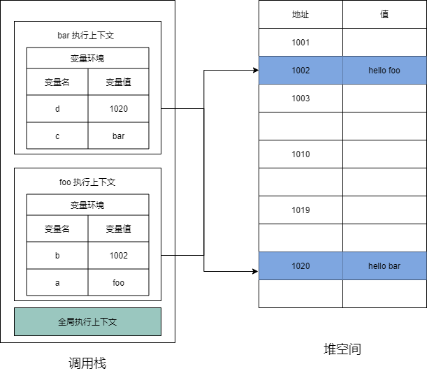

# V8引擎的垃圾回收机制(简易)

## 前言

虽然我之前整理过一篇 v8 垃圾回收机制的[文章](https://huitoutunao.com/guide/js_subject/V8%E5%BC%95%E6%93%8E%E7%9A%84%E5%9E%83%E5%9C%BE%E5%9B%9E%E6%94%B6%E6%9C%BA%E5%88%B6-%E5%AE%8C%E6%95%B4.html)，但是阅读起来比较枯燥不利于理解。最近因为学习了李兵老师的[《浏览器工作原理与实践》](https://time.geekbang.org/column/intro/216)课程，我发现他讲的 v8 垃圾回收机制比较通俗易懂，所以才有了这篇文章。

## 调用栈的数据回收

我们先见下面的代码片段：
```js
function foo () {
    var a = 'foo'
    var b = {
        value: 'hello foo'
    }

    function bar () {
        var c = 'bar'
        var d = {
            value: 'hello bar'
        }
    }
    bar()
}
foo()
```

当执行到 bar 函数时，它的内存模型如下图：



与此同时，还有一个记录当前执行状态的指针（称为 ESP），指向调用栈中 bar 函数的执行上下文，表示当前正在执行 bar 函数。

接着，当 bar 函数执行完成之后，函数执行流程就进入了 foo 函数，那这时就需要销毁 bar 函数的执行上下文了。ESP 这时候就帮上忙了，JavaScript 会将 ESP 下移到 foo 函数的执行上下文，这个下移操作就是销毁 bar 函数执行上下文的过程。

所以说，当一个函数执行结束之后，JavaScript 引擎会通过向下移动 ESP 来销毁该函数保存在栈中的执行上下文。

## 堆的数据回收

通过 ESP 可以释放调用栈中的无效内存，但是保存在堆中的两个对象依然占用着空间（1002,1020）。要回收堆中的垃圾数据，就需要用到 JavaScript 中的垃圾回收器了，以 V8 引擎作为研究对象。

### 代际假说和分代收集

代际假说具有以下两个特点：
1. 大部分对象在内存中存在的时间很短，简单来说，就是很多对象一经分配内存，很快就变得不可访问。
2. 不死的对象，会活得更久。

V8 引擎的垃圾回收算法会将堆分为新生代和老生代两个区域，新生代中存放的是生存时间短的对象，老生代中存放的生存时间久的对象。新生区通常只支持 1～8M 的容量，而老生区支持的容量就大很多了。对于这两块区域，V8 分别使用两个不同的垃圾回收器，以便更高效地实施垃圾回收。

- 副垃圾回收器，主要负责新生代的垃圾回收。
- 主垃圾回收器，主要负责老生代的垃圾回收。

### 垃圾回收器的工作流程

基础的工作流程：
1. 标记空间中的活动对象和非活动对象，非活动对象是可以进行垃圾回收处理的。
2. 统一清理非活动对象所占据的内存。
3. 内存整理。一般来说，频繁回收对象后，内存中就会存在大量不连续空间，我们把这些不连续的内存空间称为内存碎片。当内存中出现了大量的内存碎片之后，如果需要分配较大连续内存的时候，就有可能出现内存不足的情况。

#### 副垃圾回收器

这个主要负责新生区的垃圾回收，虽然这个新生区不大，但是回收还是比较频繁的。

新生区使用 Scavenge 算法来进行垃圾回收，即将新生区对半分成对象区域和空闲区域，新加入的对象就放入对象区域，当对象区域被填满时，就要执行一次垃圾回收。

在垃圾回收过程中，首先要对对象区域中的垃圾做标记；标记完成之后，就进入垃圾清理阶段，副垃圾回收器会把这些存活的对象复制到空闲区域中，同时它还会把这些对象有序地排列起来，所以这个复制过程，也就相当于完成了内存整理操作，复制后空闲区域就没有内存碎片了。

完成复制后，对象区域与空闲区域进行角色翻转，也就是原来的对象区域变成空闲区域，原来的空闲区域变成了对象区域。这样就完成了垃圾对象的回收操作，同时这种角色翻转的操作还能让新生代中的这两块区域无限重复使用下去。

由于新生代中采用的 Scavenge 算法，所以每次执行清理操作时，都需要将存活的对象从对象区域复制到空闲区域。但复制操作需要时间成本，如果新生区空间设置得太大了，那么每次清理的时间就会过久，所以为了执行效率，一般新生区的空间会被设置得比较小。

也正是因为新生区的空间不大，所以很容易被存活的对象装满整个区域。为了解决这个问题，JavaScript 引擎采用了对象晋升策略，也就是经过两次垃圾回收依然还存活的对象，会被移动到老生区中。

#### 主垃圾回收器

这个主要负责老生区的垃圾回收，而且老生区的对象有两个特点，对象占用空间大，对象存活时间长。

老生区主要是使用标记-清除算法进行垃圾回收。首先是标记过程阶段。标记阶段就是从一组根元素（调用栈）开始，递归遍历这组根元素（调用栈），在这个遍历过程中，能到达（引用地址）的元素称为活动对象，没有到达的元素就可以判断为垃圾数据。

不过对一块内存多次执行标记-清除算法后，会产生大量不连续的内存碎片。而碎片过多会导致大对象无法分配到足够的连续内存，于是又产生了另外一种算法——标记-整理（Mark-Compact），这个标记过程仍然与标记-清除算法里的是一样的，但后续步骤不是直接对可回收对象进行清理，而是让所有存活的对象都向一端移动，然后直接清理掉端边界以外的内存。

#### 全停顿

全停顿指的是执行垃圾回收算法时，都需要将正在执行的 JavaScript 脚本暂停下来，待垃圾回收完毕后再恢复脚本执行。主垃圾回收器的回收步骤是标记=>清理=>整理，这难免会造成卡顿现象，所以才有了增量标记算法。

使用增量标记算法，可以把一个完整的垃圾回收任务拆分为很多小的任务，这些小的任务执行时间比较短，可以穿插在其他的 JavaScript 任务中间执行，这样就不会让用户因为垃圾回收任务而感受到页面的卡顿了。

## 结语

本文到这里就结束了。希望我这篇总结可以帮到你理解 V8 垃圾回收机制。