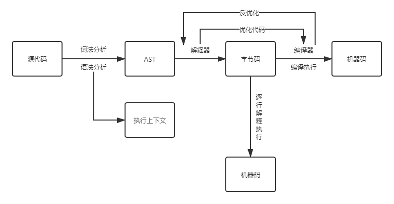
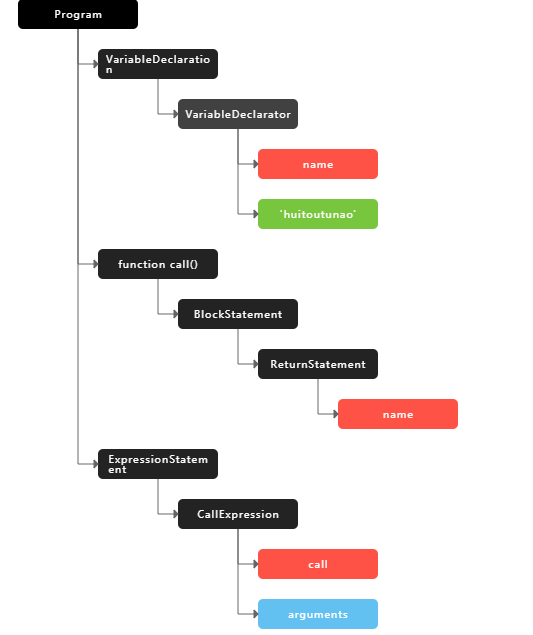

# V8 是如何执行一段 JS 代码

## 前言

了解 V8 引擎是如何执行 JavaScript 代码的机制，可以使我们在实际工作中更好的定位问题。

## 编译器

以下来自维基百科：
> 编译器（compiler）是一种计算机程序，它会将某种编程语言写成的源代码（原始语言）转换成另一种编程语言（目标语言）。

> 它主要的目的是将便于人编写、阅读、维护的高级计算机语言所写作的源代码程序，翻译为计算机能解读、运行的低阶机器语言的程序，也就是可执行文件。

例如：C、C++、C# 、Java 等高级程序语言就需要编译器进行转码。

### 它是如何“翻译”代码的呢？

在编译型语言的编译过程中，编译器首先会依次对源代码进行词法分析、语法分析，生成抽象语法树（AST），然后是优化代码，最后再生成处理器能够理解的机器码。如果编译成功，将会生成一个可执行的文件。但如果编译过程发生了语法或者其他的错误，那么编译器就会抛出异常，最后的二进制文件也不会生成成功。

## 解释器

以下来自维基百科：
> 解释器（英语：interpreter），是一种计算机程序，能够把解释型语言解释执行。解释器就像一位“中间人”。解释器边解释边执行，因此依赖于解释器的程序运行速度比较缓慢。解释器的好处是它不需要重新编译整个程序，从而减轻了每次程序更新后编译的负担。相对的编译器一次性将所有源代码编译成二进制文件，执行时无需依赖编译器或其他额外的程序。

例如：Python、JavaScript 等高级程序语言就需要解释器进行转码。

### 它是如何“翻译”代码的呢？

在解释型语言的解释过程中，同样解释器也会对源代码进行词法分析、语法分析，并生成抽象语法树（AST），不过它会再基于抽象语法树生成字节码，最后再根据字节码来执行程序、输出结果。

## V8 是如何执行一段 JS 代码



### 第一：生成抽象语法树和执行上下文

源代码首先生成抽象语法树，并生成执行上下文。生成抽象语法树（AST）是为了让解释器能够理解。

举个 AST 的例子：
```js
var name = 'huitoutunao'

function call() {
  return name
}
call()
```

[javascript-ast](https://resources.jointjs.com/demos/javascript-ast)生成的 AST 语法树如下：



抽象语法树的生成分为两个阶段，词法分析和语法分析，先分词再解析。

#### 词法分析

其作用是将一行行的源码拆解成一个个 token。所谓 token，指的是语法上不可能再分的、最小的单个字符或字符串。例如：var、name、"="、huitoutunao 等是 token。

#### 语法分析

其作用是将上一步生成的 token 数据，根据语法规则转为 AST。

### 第二：生成字节码

根据 AST 通过解释器生成字节码并且执行字节码。

#### 什么是字节码

字节码就是介于 AST 和机器码之间的一种代码。但是与特定类型的机器码无关，字节码需要通过解释器将其转换为机器码后才能执行。

#### 为什么要生成字节码

因为机器码所占用的空间比字节码大，所以使用字节码可以减少系统的内存使用。

### 第三：执行代码

## 结语

本文到这里就结束了。这是学习[《浏览器工作原理与实践》](https://time.geekbang.org/column/intro/216)李兵老师课程的笔记。希望我这篇总结可以帮到你理解 V8 执行 JavaScript 代码。