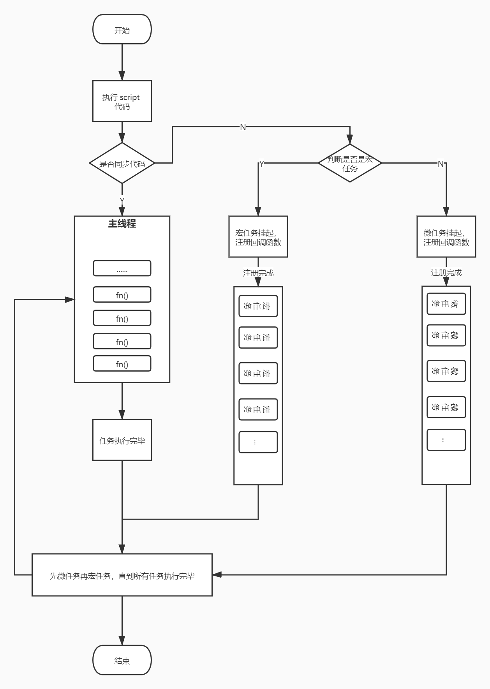

# 事件循环机制

## 前言

因为 JavaScript 的事件循环是这门语言中非常重要且基础的概念，所以今天我们一起来学习下浏览器的事件循环机制。

JavaScript 是一门单线程且永不阻塞的脚本语言。

### 为什么是单线程？

因为它是作用于浏览器交互。假设现在有两个同时的线程，一个线程在某个 DOM 节点上添加内容，另一个线程删除了这个节点，这时浏览器应该以哪个线程为准？

所以，为了避免复杂性，从一诞生，JavaScript 就是单线程，这已经成了这门语言的核心特征，将来也不会改变。

### 为什么是永不阻塞？

I/O 事件：等待一定时间才能返回结果的任务，也可称为异步任务。

永不阻塞指的是 JavaScript 执行异步任务时，主线程会挂起这个任务，等待异步任务返回结果后，再根据规则去执行相应的事件。

### Web Worker

HTML5 提出 Web Worker 标准，允许 JavaScript 脚本创建多个线程，但是子线程完全受主线程限制，例如：不得操作 DOM，没有执行 I/O 操作的权限，只能为主线程分担一些基本的计算等任务。所以，这个新标准并没有改变 JavaScript 单线程的本质。

## 事件循环初探

所有任务可以分成两种，分别是同步任务和异步任务。同步任务指的是在主线程执行的任务，异步任务指的是不进入主线程，而是进入「任务队列」的任务，只有「任务队列」通知主线程，某个异步任务可以执行了，该任务才会进入主线程执行。

「任务队列」是一个先进先出的数据结构，排在前面的事件，优先被主线程读取。主线程的读取过程基本上是自动的，只要执行栈一清空，「任务队列」上第一位的事件就自动进入主线程。

它的具体运行机制如下：

1. 同步任务都在主线程上执行，形成执行栈。
2. 主线程遇到异步任务就将它挂起，等待它执行完后（此时并未阻塞主线程），然后就在「任务队列」中放置一个事件。
3. 一旦「执行栈」的所有同步任务执行完后（此时 JS 引擎处于空闲状态），就会去读取「任务队列」里的事件，将它添加到主线程执行。
4. 主线程重复执行第三步。

这是用来说明上面步骤的流程图：


## 宏任务和微任务

进一步探索事件循环，我还发现了两个关键要素，分别是宏任务和微任务。

### 什么是宏任务

宏任务（MacroTask），也称为任务队列，是宿主环境自身发起的。宿主环境指的是 Node 或者浏览器。

### 常见宏任务

- `<script> 整体代码`
- setTimeout
- setInterval
- setImmediate
- requestAnimationFrame
- I/O
- UI 渲染
- WebApi

当我学到这时，对执行 `<script> 整体代码` 是宏任务产生疑问。于是，我去网上找了相关资料进行阅读，详情[戳这里](https://html.spec.whatwg.org/multipage/webappapis.html#task-queue)，这是 HTML Event Loop 的规范。

下面引用规范说明：
> Parsing: The HTML parser tokenizing one or more bytes, and then processing any resulting tokens, is typically a task.

或者可以这么理解，看下面这个不怎么恰当的例子，仅供参考：
```html
<!DOCTYPE html>
<html lang="en">
<head>
    <meta charset="UTF-8">
    <meta http-equiv="X-UA-Compatible" content="IE=edge">
    <meta name="viewport" content="width=device-width, initial-scale=1.0">
    <title>event loop</title>
</head>
<body>
    
<script>
    console.log('开始')
</script>
<script>
    console.log('结束')
</script>
</body>
</html>
<!-- 运行结果 -->
<!-- 开始 -->
<!-- 结束 -->
```

```html
<!DOCTYPE html>
<html lang="en">
<head>
    <meta charset="UTF-8">
    <meta http-equiv="X-UA-Compatible" content="IE=edge">
    <meta name="viewport" content="width=device-width, initial-scale=1.0">
    <title>event loop</title>
</head>
<body>
    
<script>
    setTimeout(function () {
        console.log('开始')
    }, 0)
    setTimeout(function () {
        console.log('结束')
    }, 0)
</script>
</body>
</html>

<!-- 运行结果 -->
<!-- 开始 -->
<!-- 结束 -->
```

通过上面两段代码可以看出，它们的运行结果是一样的，我们可以说明 `script 整体代码` 和 `setTimeout` 一样属于宏任务。

### 什么是微任务

微任务（MircoTask），是由 JavaScript 自身发起的，且它不是任务队列。


### 常见微任务

- 由 Promise 创建，对 `.then/catch/finally` 处理程序的执行会成为微任务
- process.nextTick
- queueMicrotask
- MutationObserver

那么宏任务和微任务在事件循环里是以怎样的顺序执行呢？我们来看下面的例子：
```js
setTimeout(function () {
    console.log('定时器')
}, 0)
Promise.resolve().then(function () {
    console.log('Promise')
})

// 运行结果
// => Promise
// => 定时器
```

第一眼会以为微任务先于宏任务，但是别忘记了整体的 `script`，所以正确的顺序是：
```
宏任务 => 微任务 => 宏任务 => 微任务 => ...
```

**注意：微任务会在执行任何其他事件处理，或渲染，或执行任何其他宏任务之前完成。所以上面的流程可以优化为：**
```
宏任务 => 微任务 => 渲染 => 宏任务 => 微任务 => ...
```

## 完整的事件循环

思考下面这段代码的输出：
```js
console.log('开始')
setTimeout(function () {
    console.log('定时器1')
}, 0)
Promise.resolve().then(function () {
    console.log('Promise1')
    setTimeout(function () {
        console.log('定时器2')
    }, 3000)
})
Promise.resolve().finally(function () {
    console.log('Promise2')
})
console.log('结束')
```

输出的结果：
```js
// => 开始
// => 结束
// => Promise1
// => Promise2
// => 定时器1
// => 定时器2
```

- `script 整体代码`作为宏任务第一个执行，将它代码分为同步任务和异步任务，同步任务直接进入主线程执行，而异步任务再细分为宏任务和微任务。
- 宏任务被主线程挂起，当它的回调函数注册完成后，再将它添加进任务队列。
- 微任务被主线程挂起，当它的回调函数注册完成后，再将它添加进微任务队列。
- 主线程内的事件都执行完后，即主线程为空时，先去检查微任务队列是否为空，如果不为空，那么就全部执行，如果没有就执行下一个宏任务。

主线程从「任务队列」中读取事件，这个过程是循环不断的，所以整个的这种运行机制又称为事件循环（Event Loop）。

根据上面的理解绘制的流程图如下：



## 结语

本文到这里就结束了。学习事件循环机制，可以让我们认识异步任务执行顺序的特点，从而减少代码运行的不确定性。适当的使用异步任务还可以提升用户体验和网站性能。

## 参考文献

- [JavaScript 运行机制详解：再谈Event Loop](https://www.ruanyifeng.com/blog/2014/10/event-loop.html)
- [详解JavaScript中的Event Loop（事件循环）机制](https://zhuanlan.zhihu.com/p/33058983)
- [Event Loop 规范](https://html.spec.whatwg.org/multipage/webappapis.html#task-queue)
- [Stack Overflow](https://stackoverflow.com/questions/25915634/difference-between-microtask-and-macrotask-within-an-event-loop-context/30910084#30910084)
- [「硬核JS」一次搞懂JS运行机制](https://juejin.cn/post/6844904050543034376#heading-26)
