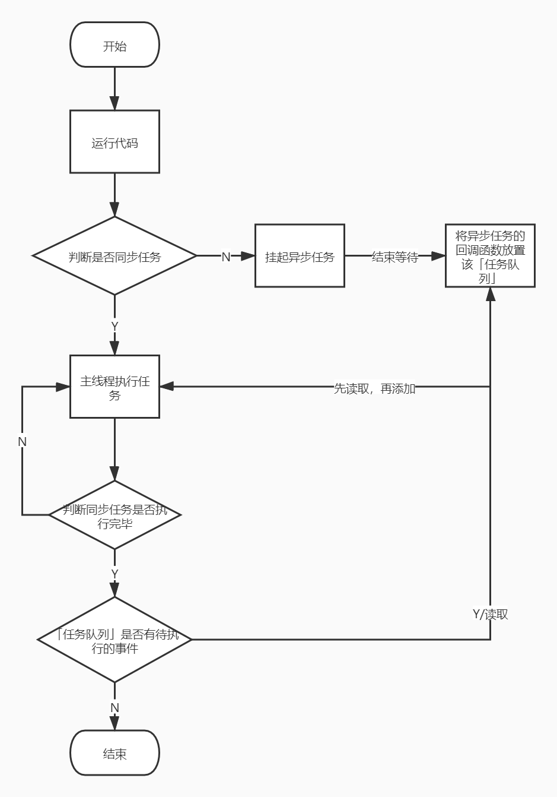

# 事件循环机制

## 前言

JavaScript 是一门单线程且永不阻塞的脚本语言。

### 为什么是单线程？

因为它是作用于浏览器交互。例如：假设现在有两个同时的线程，一个线程在某个 DOM 节点上添加内容，另一个线程删除了这个节点，这时浏览器应该以哪个线程为准？

所以，为了避免复杂性，从一诞生，JavaScript 就是单线程，这已经成了这门语言的核心特征，将来也不会改变。

### 为什么是永不阻塞？

I/O 事件：等待一定时间才能返回结果的任务，也可称为异步任务。

永不阻塞指的是 JavaScript 执行异步任务时，主线程会挂起这个任务，等待异步任务返回结果后，再根据规则去执行相应的事件。

### Web Worker

HTML5 提出 Web Worker 标准，允许 JavaScript 脚本创建多个线程，但是子线程完全受主线程限制，例如：不得操作 DOM，没有执行 I/O 操作的权限，只能为主线程分担一些基本的计算等任务。所以，这个新标准并没有改变 JavaScript 单线程的本质。

## 任务队列

所有任务可以分成两种，分别是同步任务和异步任务。同步任务指的是在主线程执行的任务，异步任务指的是不进入主线程，而是进入「任务队列」的任务，只有「任务队列」通知主线程，某个异步任务可以执行了，该任务才会进入主线程执行。

「任务队列」是一个先进先出的数据结构，排在前面的事件，优先被主线程读取。主线程的读取过程基本上是自动的，只要执行栈一清空，「任务队列」上第一位的事件就自动进入主线程。

它的具体运行机制如下：

1. 同步任务都在主线程上执行，形成执行栈。
2. 主线程遇到异步任务就将它挂起，等待它执行完后（此时并未阻塞主线程），然后就在「任务队列」中放置一个事件。
3. 一旦主线程的所有同步任务执行完后（此时 JS 引擎处于空闲状态），就会去读取「任务队列」里的事件，将它添加到主线程执行。
4. 主线程重复执行第三步。

下面是用来说明上面步骤的流程图：



## 宏任务和微任务

思考下面这段代码的输出顺序：
```js
console.log('开始')
setTimeout(function () {
    console.log('定时器1')
}, 0)
Promise.resolve().then(function () {
    console.log('Promise1')
    setTimeout(function () {
        console.log('定时器2')
    }, 3000)
})
Promise.resolve().finally(function () {
    console.log('Promise2')
})
console.log('结束')
```

输出的结果：
```js
// => 开始
// => 结束
// => Promise1
// => Promise2
// => 定时器1
// => 定时器2
```

为什么是这个输出顺序呢？我们先来了解宏任务和微任务这两个概念。

宏任务，也称为任务队列，是宿主环境自身发起的。

微任务，是由 JavaScript 自身发起的，且它不是任务队列。

宏任务（MacroTask）：`<script> 整体代码`，setTimeout，setInterval，setImmediate，requestAnimationFrame，I/O，UI 渲染，WebApi。

微任务（MircoTask）：由 Promise 创建，对 `.then/catch/finally` 处理程序的执行会成为微任务，process.nextTick，queueMicrotask，MutationObserver。

## 事件循环

主线程从「任务队列」中读取事件，这个过程是循环不断的，所以整个的这种运行机制又称为事件循环（Event Loop）。


## 参考文献

[参考1](https://www.ruanyifeng.com/blog/2014/10/event-loop.html)
[参考2](https://zhuanlan.zhihu.com/p/33058983)
[参考2-2](https://developer.mozilla.org/zh-CN/docs/Web/JavaScript/EventLoop)
[参考2-3](https://blog.csdn.net/qq_31967985/article/details/110310685)
[参考2-4](https://www.cnblogs.com/wangziye/p/9566454.html)
[参考2-5](https://developer.mozilla.org/zh-CN/docs/Web/API/HTML_DOM_API/Microtask_guide/In_depth)
[参考2-6](https://zhuanlan.zhihu.com/p/78113300)
[参考2-7](https://zh.javascript.info/event-loop#hong-ren-wu-he-wei-ren-wu)
[参考3](https://stackoverflow.com/questions/25915634/difference-between-microtask-and-macrotask-within-an-event-loop-context/30910084#30910084)
[参考4](http://latentflip.com/loupe/?code=JC5vbignYnV0dG9uJywgJ2NsaWNrJywgZnVuY3Rpb24gb25DbGljaygpIHsKICAgIHNldFRpbWVvdXQoZnVuY3Rpb24gdGltZXIoKSB7CiAgICAgICAgY29uc29sZS5sb2coJ1lvdSBjbGlja2VkIHRoZSBidXR0b24hJyk7ICAgIAogICAgfSwgMjAwMCk7Cn0pOwoKY29uc29sZS5sb2coIkhpISIpOwoKc2V0VGltZW91dChmdW5jdGlvbiB0aW1lb3V0KCkgewogICAgY29uc29sZS5sb2coIkNsaWNrIHRoZSBidXR0b24hIik7Cn0sIDUwMDApOwoKY29uc29sZS5sb2coIldlbGNvbWUgdG8gbG91cGUuIik7!!!)
