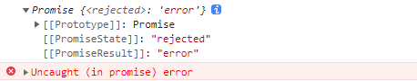
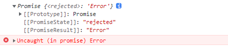
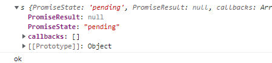

# 手撕 Promise

## 前言

不论是前端日常开发，还是前端面试题，总是会遇到 Promise 相关的问题。因此今天就来一探究竟，揭开 Promise 的神秘面纱。

## 基本结构

+ 构造函数里传入一个函数，它有两个形参 `resolve`、`reject`
+ `resolve` 函数成功时执行
+ `reject` 函数失败时执行

```js
class Promise {
  constructor(executor) {
    // resolve 函数
    const resolve = (data) => {}

    // reject 函数
    const reject = (data) => {}

    // 同步调用「执行器函数」
    executor(resolve, reject)
  }
}

const p = new Promise((resolve, reject) => {
  resolve('ok')
})

console.log(p)
```

## 三种状态实现

> 一旦状态改变，就不会再变，任何时候都可以得到这个结果。Promise 对象的状态改变，只有两种可能：从 pending 变为 fulfilled 和从 pending 变为 rejected。

+ 进行中 `pending`
+ 已成功 `fulfilled`
+ 已失败 `rejected`
+ 状态只能改变一次

在开始之前，我们先看 `Chrome` 内置的 `Promise` 输出结果：
```js
const p = new Promise((resolve, reject) => {
  // resolve('ok')
  // reject('error')
  // throw 'Error'
})

console.log(p)
```

+ 首先 `Promise` 传入的函数不执行任何操作：


+ `resolve('ok')` 结果如下：


+ `reject('error')` 结果如下：



+ `throw 'Error'` 结果如下：



+ 状态只能改变一次，运行如下代码查看效果：
```js
const p = new Promise((resolve, reject) => {
  resolve('ok')
  reject('error')
  // throw 'Error'
})

console.log(p)
```


通过上面打印的结果，`PromiseState` 指当前状态，`PromiseResult` 指结果值。现在我们模仿上面的运行结果实现如下：

### pending
```js{4,5}
class Promise {
  // 构造器
  constructor(executor) {
    this.PromiseState = 'pending' // 进行中
    this.PromiseResult = null // 结果值

    // resolve 函数
    const resolve = (data) => {}

    // reject 函数
    const reject = (data) => {}

    // 同步调用「执行器函数」
    executor(resolve, reject)
  }
}

const p = new Promise((resolve, reject) => {
  // resolve('ok')
  // reject('error')
  // throw 'Error'
})

console.log(p)
```

### fulfilled
```js{8-14}
class Promise {
  // 构造器
  constructor(executor) {
    this.PromiseState = 'pending' // 进行中
    this.PromiseResult = null // 结果值

    // resolve 函数
    const resolve = (data) => {
      // 修改对象状态
      this.PromiseState = 'fulfilled' // 已成功

      // 设置对象结果值
      this.PromiseResult = data
    }

    // reject 函数
    const reject = (data) => {}

    // 同步调用「执行器函数」
    executor(resolve, reject)
  }
}
```

### rejected
```js{17-23,26-32}
class Promise {
  // 构造器
  constructor(executor) {
    this.PromiseState = 'pending' // 进行中
    this.PromiseResult = null // 结果值

    // resolve 函数
    const resolve = (data) => {
      // 修改对象状态
      this.PromiseState = 'fulfilled' // 已成功

      // 设置对象结果值
      this.PromiseResult = data
    }

    // reject 函数
    const reject = (data) => {
      // 修改对象状态
      this.PromiseState = 'rejected' // 已失败

      // 设置对象结果值
      this.PromiseResult = data
    }

    // 捕获 throw
    try {
      // 同步调用「执行器函数」
      executor(resolve, reject)
    } catch (error) {
      // 修改 promise 对象状态为失败
      reject(error)
    }
  }
}
```

### 状态只能改变一次

目前我们的 Promise 运行如下代码：
```js
const p = new Promise((resolve, reject) => {
  resolve('ok')
  reject('error')
  // throw 'Error'
})

console.log(p)
```

打印结果如下：


输出的结果明显有问题，正确的状态应是 `fulfilled`，因为状态只能是 `pending` 变成 `fulfilled`，或者 `pending` 变成 `rejected`，所以通过判断状态是否为 `pending` 即可修复该问题。

优化代码如下：
```js{10,22}
class Promise {
  // 构造器
  constructor(executor) {
    this.PromiseState = 'pending' // 进行中
    this.PromiseResult = null // 结果值

    // resolve 函数
    const resolve = (data) => {
      // 判断状态是否为 pending
      if (this.PromiseState !== 'pending') return

      // 修改对象状态
      this.PromiseState = 'fulfilled' // 已成功

      // 设置对象结果值
      this.PromiseResult = data
    }

    // reject 函数
    const reject = (data) => {
      // 判断状态是否为 pending
      if (this.PromiseState !== 'pending') return

      // 修改对象状态
      this.PromiseState = 'rejected' // 已失败

      // 设置对象结果值
      this.PromiseResult = data
    }

    // 捕获 throw
    try {
      // 同步调用「执行器函数」
      executor(resolve, reject)
    } catch (error) {
      // 修改 promise 对象状态为失败
      reject(error)
    }
  }
}
```

## `Promise.prototype.then()`

> 它的作用是为 Promise 实例添加状态改变时的回调函数。then 方法的第一个参数是 resolved 状态的回调函数，第二个参数是 rejected 状态的回调函数，它们都是可选的。

在开始之前，我们先看 `Chrome` 内置的 `Promise` 输出结果：
```js
const p = new Promise((resolve, reject) => {
  resolve('ok')
  // reject('error')
  // throw 'Error'
})

p.then((value) => {
  console.log(value) // 输出：ok
}, (error) => {
  console.warn(error)
})
```

通过上面运行效果，需要在 `Promise` 类添加 `then` 方法：
```js{42-52}
class Promise {
  // 构造器
  constructor(executor) {
    this.PromiseState = 'pending' // 进行中
    this.PromiseResult = null // 结果值

    // resolve 函数
    const resolve = (data) => {
      // 判断状态是否为 pending
      if (this.PromiseState !== 'pending') return

      // 修改对象状态
      this.PromiseState = 'fulfilled' // 已成功

      // 设置对象结果值
      this.PromiseResult = data
    }

    // reject 函数
    const reject = (data) => {
      // 判断状态是否为 pending
      if (this.PromiseState !== 'pending') return

      // 修改对象状态
      this.PromiseState = 'rejected' // 已失败

      // 设置对象结果值
      this.PromiseResult = data
    }

    // 捕获 throw
    try {
      // 同步调用「执行器函数」
      executor(resolve, reject)
    } catch (error) {
      // 修改 promise 对象状态为失败
      reject(error)
    }
  }

  // 添加 then 方法
  then(handleResolve, handleReject) {
    // 根据 PromiseState 调用对应回调函数
    if (this.PromiseState === 'fulfilled') {
      // PromiseResult 传递给回调函数的结果值
      handleResolve(this.PromiseResult)
    }
    if (this.PromiseState === 'rejected') {
      // PromiseResult 传递给回调函数的结果值
      handleReject(this.PromiseResult)
    }
  }
}
```

## 异步实现

按照惯例，先看 `Chrome` 内置 `Promise` 的表现：
```js
const p = new Promise((resolve, reject) => {
  setTimeout(() => {
    resolve('ok')
  }, 1000)
  // reject('error')
  // throw 'Error'
})

p.then((value) => {
  console.log(value) // => 1s 后输出 ok
}, (error) => {
  console.warn(error)
})
```

因为 `resolve` 或 `reject` 在 `setTimeout` 内执行时，`then` 方法的 `PromiseState` 还是 `pending` 状态，所以我们就需要在 `then` 方法里把成功或失败的回调函数存到公用对象，当 `resolve` 或 `reject` 执行改变状态时，就调用它们。

优化代码如下：
```js{20-22,37-39,65-70}
class Promise {
  // 构造器
  constructor(executor) {
    this.PromiseState = 'pending' // 进行中
    this.PromiseResult = null // 结果值
    this.callbacks = {}

    // resolve 函数
    const resolve = (data) => {
      // 判断状态是否为 pending
      if (this.PromiseState !== 'pending') return

      // 修改对象状态
      this.PromiseState = 'fulfilled' // 已成功

      // 设置对象结果值
      this.PromiseResult = data

      // 状态成功时执行回调函数
      if (this.callbacks.handleResolve) {
        this.callbacks.handleResolve(data)
      }
    }

    // reject 函数
    const reject = (data) => {
      // 判断状态是否为 pending
      if (this.PromiseState !== 'pending') return

      // 修改对象状态
      this.PromiseState = 'rejected' // 已失败

      // 设置对象结果值
      this.PromiseResult = data

      // 状态失败时执行回调函数
      if (this.callbacks.handleReject) {
        this.callbacks.handleReject(data)
      }
    }

    // 捕获 throw
    try {
      // 同步调用「执行器函数」
      executor(resolve, reject)
    } catch (error) {
      // 修改 promise 对象状态为失败
      reject(error)
    }
  }

  // 添加 then 方法
  then(handleResolve, handleReject) {
    // 根据 PromiseState 调用对应回调函数
    if (this.PromiseState === 'fulfilled') {
      // PromiseResult 传递给回调函数的结果值
      handleResolve(this.PromiseResult)
    }
    if (this.PromiseState === 'rejected') {
      // PromiseResult 传递给回调函数的结果值
      handleReject(this.PromiseResult)
    }

    // 等待状态时保存 handleResolve 和 handleReject 函数，后面改变状态时调用
    if (this.PromiseState === 'pending') {
      this.callbacks = {
        handleResolve,
        handleReject,
      }
    }
  }
}
```

再看 `Chrome` 内置 `Promise` 执行多个回调的表现：
```js
const p = new Promise((resolve, reject) => {
  setTimeout(() => {
    resolve('ok')
    // reject('error')
  }, 1000)
  // reject('error')
  // throw 'Error'
})

p.then((value) => {
  console.log(value) // 1s 后输出 ok
}, (error) => {
  console.warn(error)
})

p.then((value) => {
  alert(value) // 1s 后弹出 ok
}, (error) => {
  alert(error)
})
```

我们需要借助 `callbacks` 数组保存回调函数，因此改造代码如下：
```js{6,20-22,37-39,66-69}
class Promise {
  // 构造器
  constructor(executor) {
    this.PromiseState = 'pending' // 进行中
    this.PromiseResult = null // 结果值
    this.callbacks = []

    // resolve 函数
    const resolve = (data) => {
      // 判断状态是否为 pending
      if (this.PromiseState !== 'pending') return

      // 修改对象状态
      this.PromiseState = 'fulfilled' // 已成功

      // 设置对象结果值
      this.PromiseResult = data

      // 状态成功时执行回调函数
      this.callbacks.forEach((item) => {
        item.handleResolve(data)
      })
    }

    // reject 函数
    const reject = (data) => {
      // 判断状态是否为 pending
      if (this.PromiseState !== 'pending') return

      // 修改对象状态
      this.PromiseState = 'rejected' // 已失败

      // 设置对象结果值
      this.PromiseResult = data

      // 状态失败时执行回调函数
      this.callbacks.forEach((item) => {
        item.handleReject(data)
      })
    }

    // 捕获 throw
    try {
      // 同步调用「执行器函数」
      executor(resolve, reject)
    } catch (error) {
      // 修改 promise 对象状态为失败
      reject(error)
    }
  }

  // 添加 then 方法
  then(handleResolve, handleReject) {
    // 根据 PromiseState 调用对应回调函数
    if (this.PromiseState === 'fulfilled') {
      // PromiseResult 传递给回调函数的结果值
      handleResolve(this.PromiseResult)
    }
    if (this.PromiseState === 'rejected') {
      // PromiseResult 传递给回调函数的结果值
      handleReject(this.PromiseResult)
    }

    // 等待状态时保存 handleResolve 和 handleReject 函数，后面改变状态时调用
    if (this.PromiseState === 'pending') {
      this.callbacks.push({
        handleResolve,
        handleReject,
      })
    }
  }
}
```

## 同步执行 `then` 的返回结果

首先看 `Chrome` 内置 `Promise` 的运行结果：
```js
const p = new Promise((resolve, reject) => {
  resolve('ok')
})

const res = p.then((value) => {
  console.log(value)
  // 因为这里没有 return 返回值，所以结果是 undefined
}, (error) => {
  console.warn(error)
})

console.log(res)
```

`res` 的结果如下图：


+ 结果是新的 `Promise` 对象
+ 结果值 `(PromiseResult)` 是 `then` 方法中 `handleResolve` 回调函数的返回值
+ 结果状态 `(PromiseState)` 是 `fulfilled`

实现代码如下：
```js{55-75}
class Promise {
  // 构造器
  constructor(executor) {
    this.PromiseState = 'pending' // 进行中
    this.PromiseResult = null // 结果值
    this.callbacks = []

    // resolve 函数
    const resolve = (data) => {
      // 判断状态是否为 pending
      if (this.PromiseState !== 'pending') return

      // 修改对象状态
      this.PromiseState = 'fulfilled' // 已成功

      // 设置对象结果值
      this.PromiseResult = data

      // 状态成功时执行回调函数
      this.callbacks.forEach((item) => {
        item.handleResolve(data)
      })
    }

    // reject 函数
    const reject = (data) => {
      // 判断状态是否为 pending
      if (this.PromiseState !== 'pending') return

      // 修改对象状态
      this.PromiseState = 'rejected' // 已失败

      // 设置对象结果值
      this.PromiseResult = data

      // 状态失败时执行回调函数
      this.callbacks.forEach((item) => {
        item.handleReject(data)
      })
    }

    // 捕获 throw
    try {
      // 同步调用「执行器函数」
      executor(resolve, reject)
    } catch (error) {
      // 修改 promise 对象状态为失败
      reject(error)
    }
  }

  // 添加 then 方法
  then(handleResolve, handleReject) {
    // 返回新的 Promise 对象
    return new Promise((resolve, reject) => {
      // 根据 PromiseState 调用对应回调函数
      if (this.PromiseState === 'fulfilled') {
        try {
          // PromiseResult 传递给回调函数的结果值
          const result = handleResolve(this.PromiseResult)
          if (result instanceof Promise) {
            // 如果是 Promise 类型对象
            result.then((v) => {
              resolve(v)
            }, (e) => {
              reject(e)
            })
          } else {
            // 结果状态改为成功
            resolve(result)
          }
        } catch (e) {
          reject(e)
        }
      }
      if (this.PromiseState === 'rejected') {
        // PromiseResult 传递给回调函数的结果值
        handleReject(this.PromiseResult)
      }

      // 等待状态时保存 handleResolve 和 handleReject 函数，后面改变状态时调用
      if (this.PromiseState === 'pending') {
        this.callbacks.push({
          handleResolve,
          handleReject,
        })
      }
    })
  }
}

// 示例
const p = new Promise((resolve, reject) => {
  resolve('ok')
  // reject('error')
})

const res = p.then((value) => {
  console.log(value)
  // return 'ok'
  // return new Promise((resolve, reject) => {
  //   // resolve('success')
  //   // reject('error')
  // })
  throw 'fail'
}, (error) => {
  console.warn(error)
})

console.log(res)
```

## 异步状态 `then` 方法的返回结果

首先看 `Chrome` 内置 `Promise` 的运行结果：
```js
const p = new Promise((resolve, reject) => {
  setTimeout(() => {
    resolve('ok')
  }, 1000)
})

const res = p.then((value) => {
  console.log(value)
  // 因为这里没有 return 返回值，所以结果是 undefined
}, (error) => {
  console.warn(error)
})

console.log(res)
```

`res` 的结果如下图：


对比目前手写 `Promise` 的 `res` 输出结果如下图：



观察发现 `PromiseState` 状态并没有变为 `fulfilled`，说明 `then` 方法中 `pending` 逻辑需要优化。

改造代码如下：
```js{82-119}
class Promise {
  // 构造器
  constructor(executor) {
    this.PromiseState = 'pending' // 进行中
    this.PromiseResult = null // 结果值
    this.callbacks = []

    // resolve 函数
    const resolve = (data) => {
      // 判断状态是否为 pending
      if (this.PromiseState !== 'pending') return

      // 修改对象状态
      this.PromiseState = 'fulfilled' // 已成功

      // 设置对象结果值
      this.PromiseResult = data

      // 状态成功时执行回调函数
      this.callbacks.forEach((item) => {
        item.handleResolve(data)
      })
    }

    // reject 函数
    const reject = (data) => {
      // 判断状态是否为 pending
      if (this.PromiseState !== 'pending') return

      // 修改对象状态
      this.PromiseState = 'rejected' // 已失败

      // 设置对象结果值
      this.PromiseResult = data

      // 状态失败时执行回调函数
      this.callbacks.forEach((item) => {
        item.handleReject(data)
      })
    }

    // 捕获 throw
    try {
      // 同步调用「执行器函数」
      executor(resolve, reject)
    } catch (error) {
      // 修改 promise 对象状态为失败
      reject(error)
    }
  }

  // 添加 then 方法
  then(handleResolve, handleReject) {
    // 返回新的 Promise 对象
    return new Promise((resolve, reject) => {
      // 根据 PromiseState 调用对应回调函数
      if (this.PromiseState === 'fulfilled') {
        try {
          // PromiseResult 传递给回调函数的结果值
          const result = handleResolve(this.PromiseResult)
          if (result instanceof Promise) {
            // 如果是 Promise 类型对象
            result.then((v) => {
              resolve(v)
            }, (e) => {
              reject(e)
            })
          } else {
            // 结果状态改为成功
            resolve(result)
          }
        } catch (e) {
          reject(e)
        }
      }
      if (this.PromiseState === 'rejected') {
        // PromiseResult 传递给回调函数的结果值
        handleReject(this.PromiseResult)
      }

      // 等待状态时保存 handleResolve 和 handleReject 函数，后面改变状态时调用
      if (this.PromiseState === 'pending') {
        this.callbacks.push({
          handleResolve: () => {
            try {
              const result = handleResolve(this.PromiseResult)
              if (result instanceof Promise) {
                result.then((v) => {
                  resolve(v)
                }, (e) => {
                  reject(e)
                })
              } else {
                // 返回结果不是 Promise 对象，状态变为 fulfilled
                resolve(result)
              }
            } catch (e) {
              reject(e)
            }
          },
          handleReject: () => {
            try {
              const result = handleReject(this.PromiseResult)
              if (result instanceof Promise) {
                result.then((v) => {
                  resolve(v)
                }, (e) => {
                  reject(e)
                })
              } else {
                // 返回结果不是 Promise 对象，状态变为 fulfilled
                resolve(result)
              }
            } catch (e) {
              reject(e)
            }
          },
        })
      }
    })
  }
}

// 示例
const p = new Promise((resolve, reject) => {
  setTimeout(() => {
    resolve('ok')
    // reject('err')
  }, 1000)
})

const res = p.then((value) => {
  // console.log(value)
  return 'success'
  // return new Promise((resolve, reject) => {
  //   resolve('hello promise')
  // })
  // throw 'fail'
}, (error) => {
  console.warn(error) // 返回结果是 undefined
  // return 'Err'
  // return new Promise((resolve, reject) => {
  //   reject('hello promise')
  // })
  // throw 'fail'
})

console.log(res)
```


## 参考资料

+ [ES6 中文文档](https://es6.ruanyifeng.com/#docs/promise)
+ [手撕 Promise](https://juejin.cn/post/6845166891061739528)
+ [Promises/A+](https://promisesaplus.com/)
