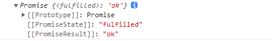
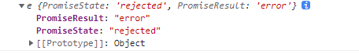

# 手撕 Promise

## 前言

不论是前端日常开发，还是前端面试题，总是会遇到 Promise 相关的问题。因此今天就来一探究竟，揭开 Promise 的神秘面纱。

## 基本结构

+ 构造函数里传入一个函数，它有两个形参 `resolve`、`reject`
+ `resolve` 函数成功时执行
+ `reject` 函数失败时执行

```js
class Promise {
  constructor(executor) {
    // resolve 函数
    const resolve = (data) => {}

    // reject 函数
    const reject = (data) => {}

    // 同步调用「执行器函数」
    executor(resolve, reject)
  }
}

const p = new Promise((resolve, reject) => {
  resolve('ok')
})

console.log(p)
```

## 三种状态实现

> 一旦状态改变，就不会再变，任何时候都可以得到这个结果。Promise 对象的状态改变，只有两种可能：从 pending 变为 fulfilled 和从 pending 变为 rejected。

+ 进行中 `pending`
+ 已成功 `fulfilled`
+ 已失败 `rejected`
+ 状态只能改变一次

在开始之前，我们先看 `Chrome` 内置的 `Promise` 输出结果：
```js
const p = new Promise((resolve, reject) => {
  // resolve('ok')
  // reject('error')
  // throw 'Error'
})

console.log(p)
```

+ 首先 `Promise` 传入的函数不执行任何操作：


+ `resolve('ok')` 结果如下：


+ `reject('error')` 结果如下：


+ `throw 'Error'` 结果如下：


+ 状态只能改变一次，运行如下代码查看效果：
```js
const p = new Promise((resolve, reject) => {
  resolve('ok')
  reject('error')
  // throw 'Error'
})

console.log(p)
```



通过上面打印的结果，`PromiseState` 指当前状态，`PromiseResult` 指结果值。现在我们模仿上面的运行结果实现如下：

### pending
```js{4,5}
class Promise {
  // 构造器
  constructor(executor) {
    this.PromiseState = 'pending' // 进行中
    this.PromiseResult = null // 结果值

    // resolve 函数
    const resolve = (data) => {}

    // reject 函数
    const reject = (data) => {}

    // 同步调用「执行器函数」
    executor(resolve, reject)
  }
}

const p = new Promise((resolve, reject) => {
  // resolve('ok')
  // reject('error')
  // throw 'Error'
})

console.log(p)
```

### fulfilled
```js{8-14}
class Promise {
  // 构造器
  constructor(executor) {
    this.PromiseState = 'pending' // 进行中
    this.PromiseResult = null // 结果值

    // resolve 函数
    const resolve = (data) => {
      // 修改对象状态
      this.PromiseState = 'fulfilled' // 已成功

      // 设置对象结果值
      this.PromiseResult = data
    }

    // reject 函数
    const reject = (data) => {}

    // 同步调用「执行器函数」
    executor(resolve, reject)
  }
}
```

### rejected
```js{17-23,26-32}
class Promise {
  // 构造器
  constructor(executor) {
    this.PromiseState = 'pending' // 进行中
    this.PromiseResult = null // 结果值

    // resolve 函数
    const resolve = (data) => {
      // 修改对象状态
      this.PromiseState = 'fulfilled' // 已成功

      // 设置对象结果值
      this.PromiseResult = data
    }

    // reject 函数
    const reject = (data) => {
      // 修改对象状态
      this.PromiseState = 'rejected' // 已失败

      // 设置对象结果值
      this.PromiseResult = data
    }

    // 捕获 throw
    try {
      // 同步调用「执行器函数」
      executor(resolve, reject)
    } catch (error) {
      // 修改 promise 对象状态为失败
      reject(error)
    }
  }
}
```

### 状态只能改变一次

目前我们的 Promise 运行如下代码：
```js
const p = new Promise((resolve, reject) => {
  resolve('ok')
  reject('error')
  // throw 'Error'
})

console.log(p)
```

打印结果如下：



输出的结果明显有问题，正确的状态应是 `fulfilled`，因为状态只能是 `pending` 变成 `fulfilled`，或者 `pending` 变成 `rejected`，所以通过判断状态是否为 `pending` 即可修复该问题。

优化代码如下：
```js{10,22}
class Promise {
  // 构造器
  constructor(executor) {
    this.PromiseState = 'pending' // 进行中
    this.PromiseResult = null // 结果值

    // resolve 函数
    const resolve = (data) => {
      // 判断状态是否为 pending
      if (this.PromiseState !== 'pending') return

      // 修改对象状态
      this.PromiseState = 'fulfilled' // 已成功

      // 设置对象结果值
      this.PromiseResult = data
    }

    // reject 函数
    const reject = (data) => {
      // 判断状态是否为 pending
      if (this.PromiseState !== 'pending') return

      // 修改对象状态
      this.PromiseState = 'rejected' // 已失败

      // 设置对象结果值
      this.PromiseResult = data
    }

    // 捕获 throw
    try {
      // 同步调用「执行器函数」
      executor(resolve, reject)
    } catch (error) {
      // 修改 promise 对象状态为失败
      reject(error)
    }
  }
}
```

## `Promise.prototype.then()`

> 它的作用是为 Promise 实例添加状态改变时的回调函数。then 方法的第一个参数是 resolved 状态的回调函数，第二个参数是 rejected 状态的回调函数，它们都是可选的。

在开始之前，我们先看 `Chrome` 内置的 `Promise` 输出结果：
```js
const p = new Promise((resolve, reject) => {
  resolve('ok')
  // reject('error')
  // throw 'Error'
})

p.then((value) => {
  console.log(value) // 输出：ok
}, (error) => {
  console.warn(error)
})
```

通过上面运行效果，需要在 `Promise` 类添加 `then` 方法：
```js{42-52}
class Promise {
  // 构造器
  constructor(executor) {
    this.PromiseState = 'pending' // 进行中
    this.PromiseResult = null // 结果值

    // resolve 函数
    const resolve = (data) => {
      // 判断状态是否为 pending
      if (this.PromiseState !== 'pending') return

      // 修改对象状态
      this.PromiseState = 'fulfilled' // 已成功

      // 设置对象结果值
      this.PromiseResult = data
    }

    // reject 函数
    const reject = (data) => {
      // 判断状态是否为 pending
      if (this.PromiseState !== 'pending') return

      // 修改对象状态
      this.PromiseState = 'rejected' // 已失败

      // 设置对象结果值
      this.PromiseResult = data
    }

    // 捕获 throw
    try {
      // 同步调用「执行器函数」
      executor(resolve, reject)
    } catch (error) {
      // 修改 promise 对象状态为失败
      reject(error)
    }
  }

  // 添加 then 方法
  then(handleResolve, handleReject) {
    // 根据 PromiseState 调用对应回调函数
    if (this.PromiseState === 'fulfilled') {
      // PromiseResult 传递给回调函数的结果值
      handleResolve(this.PromiseResult)
    }
    if (this.PromiseState === 'rejected') {
      // PromiseResult 传递给回调函数的结果值
      handleReject(this.PromiseResult)
    }
  }
}
```

## 异步实现

当 resolve 在 setTimeout 内执行，then 的 state 还是 pending 等待状态。我们就需要在 then 调用的时候，将成功和失败存到各自的数组，一旦 reject 或者 resolve，就调用它们。

```js
class MyPromise {
  constructor(fn) {
    this.status = 'pending'
    this.success = ''
    this.error = ''
    this.resolveQueue = []
    this.rejectQueue = []

    const resolve = (res) => {
      if (this.status === 'pending') {
        this.success = res
        this.status = 'success'
        this.resolveQueue.forEach((item) => item())
      }
    }

    const reject = (err) => {
      if (this.status === 'pending') {
        this.error = err
        this.status = 'error'
        this.rejectQueue.forEach((item) => item())
      }
    }

    fn(resolve, reject)
  }

  then(handleFullfilled, handleRejected) {
    if (this.status === 'success') {
      handleFullfilled(this.success)
    }

    if (this.status === 'error') {
      handleRejected(this.error)
    }

    if (this.status === 'pending') {
      this.resolveQueue.push(() => {
        handleFullfilled(this.success)
      })

      this.rejectQueue.push(() => {
        handleRejected(this.error)
      })
    }
  }
}

const mp = new MyPromise((resolve) => {
  setTimeout(() => resolve('我是成功'), 3000)
})
mp.then((res) => {
  console.log('进入then的fulfilled,', res)
})
// => 3s 后输出结果
// 进入then的fulfilled, 我是成功
```

## then 链式调用

原理：在第一个 then 中返回一个新的 Promise。

```js
const resolvePromise = (chainPromise, x, resolve, reject) => {
  let flag
  if (x === chainPromise) {
    return reject(new TypeError('Chaining cycle detected for promise'))
  }

  if (x !== null && (typeof x === 'object' || typeof x === 'function')) {
    try {
      const { then } = x

      if (typeof then === 'function') {
        then.call(
          x,
          (res) => {
            if (flag) {
              return
            }
            flag = true
            resolvePromise(chainPromise, res, resolve, reject)
          },
          (err) => {
            if (flag) {
              return
            }
            flag = true
            reject(err)
          }
        )
      } else {
        resolve(x)
      }
    } catch (e) {
      if (flag) {
        return
      }
      flag = true
      reject(e)
    }
  } else {
    resolve(x)
  }
}

class MyPromise {
  constructor(fn) {
    this.status = 'pending'
    this.success = ''
    this.error = ''
    this.resolveQueue = []
    this.rejectQueue = []

    const resolve = (res) => {
      if (this.status === 'pending') {
        this.success = res
        this.status = 'success'
        this.resolveQueue.forEach((item) => item())
      }
    }

    const reject = (err) => {
      if (this.status === 'pending') {
        this.error = err
        this.status = 'error'
        this.rejectQueue.forEach((item) => item())
      }
    }

    fn(resolve, reject)
  }

  then(handleFullfilled, handleRejected) {
    const chainPromise = new Promise((resolve, reject) => {
      if (this.status === 'success') {
        const x = handleFullfilled(this.success)
        resolvePromise(chainPromise, x, resolve, reject)
      }

      if (this.status === 'error') {
        const x = handleRejected(this.error)
        resolvePromise(chainPromise, x, resolve, reject)
      }

      if (this.status === 'pending') {
        this.resolveQueue.push(() => {
          const x = handleFullfilled(this.success)
          resolvePromise(chainPromise, x, resolve, reject)
        })

        this.rejectQueue.push(() => {
          const x = handleRejected(this.error)
          resolvePromise(chainPromise, x, resolve, reject)
        })
      }
    })

    return chainPromise
  }
}

// 测试用例
new MyPromise((resolve) => {
  resolve('我是第一名')
})
  .then((res) => {
    console.log('进入1', res)
    return new Promise((resolve) => {
      resolve('hello world')
    })
  })
  .then((res) => {
    console.log('进入2', res)
  })
// => 结果
// 进入1 我是第一名
// 进入2 hello world
```

## onFulfilled 和 onRejected 的异步调用

原理：`setTimeout` 解决异步问题

以上面为基础，优化如下：

```js
const resolvePromise = (chainPromise, x, resolve, reject) => {
  let flag
  if (x === chainPromise) {
    return reject(new TypeError('Chaining cycle detected for promise'))
  }

  if (x !== null && (typeof x === 'object' || typeof x === 'function')) {
    try {
      const { then } = x

      if (typeof then === 'function') {
        then.call(
          x,
          (res) => {
            if (flag) {
              return
            }
            flag = true
            resolvePromise(chainPromise, res, resolve, reject)
          },
          (err) => {
            if (flag) {
              return
            }
            flag = true
            reject(err)
          }
        )
      } else {
        resolve(x)
      }
    } catch (e) {
      if (flag) {
        return
      }
      flag = true
      reject(e)
    }
  } else {
    resolve(x)
  }
}

class MyPromise {
  constructor(fn) {
    this.status = 'pending'
    this.success = ''
    this.error = ''
    this.resolveQueue = []
    this.rejectQueue = []

    const resolve = (res) => {
      if (this.status === 'pending') {
        this.success = res
        this.status = 'success'
        this.resolveQueue.forEach((item) => item())
      }
    }

    const reject = (err) => {
      if (this.status === 'pending') {
        this.error = err
        this.status = 'error'
        this.rejectQueue.forEach((item) => item())
      }
    }

    fn(resolve, reject)
  }

  then(handleFullfilled, handleRejected) {
    // 值穿透
    handleFullfilled = typeof handleFullfilled === 'function' ? handleFullfilled : (res) => res
    handleRejected =
      typeof handleRejected === 'function'
        ? handleFullfilled
        : (err) => {
            throw err
          }

    const chainPromise = new Promise((resolve, reject) => {
      if (this.status === 'success') {
        const x = handleFullfilled(this.success)
        resolvePromise(chainPromise, x, resolve, reject)
      }

      if (this.status === 'error') {
        const x = handleRejected(this.error)
        resolvePromise(chainPromise, x, resolve, reject)
      }

      if (this.status === 'pending') {
        this.resolveQueue.push(() => {
          const x = handleFullfilled(this.success)
          resolvePromise(chainPromise, x, resolve, reject)
        })

        this.rejectQueue.push(() => {
          const x = handleRejected(this.error)
          resolvePromise(chainPromise, x, resolve, reject)
        })
      }
    })

    return chainPromise
  }
}
```

## 参考资料

- [ES6 中文文档](https://es6.ruanyifeng.com/#docs/promise)
- [手撕 Promise](https://juejin.cn/post/6845166891061739528)
- [Promises/A+](https://promisesaplus.com/)
