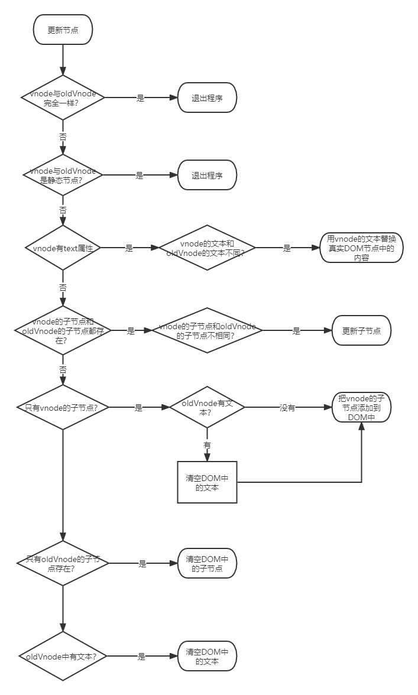

# Vue 源码之虚拟 DOM

## 前言

这是 `Vue.js` 的源码分析，记录自己在学习源码时的心得和收获。

`Vue.js` 的源码目录结构如下：
```
src
├── compiler        # 编译相关 
├── core            # 核心代码 
├── platforms       # 不同平台的支持
├── server          # 服务端渲染
├── sfc             # .vue 文件解析
├── shared          # 共享代码
```

重点关注 `core` 文件夹下面的代码文件，因为这是 `Vue.js` 的核心代码。

## VNode

### VNode 是什么

VNode 可以理解成节点描述对象，它描述了应该怎样去创建真实的 DOM，即 JavaScript 对象版本的 DOM 元素。

VNode 创建 DOM 并插入视图。
```
vnode (创建) => DOM (渲染) => 视图
```

### VNode 的作用

最重要的的一个作用是 VNode 更新前后的对比，这样只更新差异的节点，减少性能浪费。

### VNode 的类型

- 注释节点
- 文本节点
- 元素节点
- 组件节点
- 函数式节点
- 克隆节点

## patch

### 介绍

patch 是在现有 DOM 上进行修改来达到渲染视图的目的。对现有 DOM 进行修改需要做三件事：
- 创建新增的节点
- 删除已经废弃的节点
- 修改需要更新的节点

### 新增节点

以下这几种情况需要新增节点
- 首次渲染页面，oldVNode 不存在，所以需要使用 vnode 来渲染 DOM
- vnode 和 oldVNode 不是同一个节点，即vnode 是新节点而 oldVNode 是废弃节点

元素节点、注释节点和文本节点。整个流程如下：


### 删除节点

以 vnode 为标准，vnode 没有的节点都属于废弃的节点，应该在 DOM 中删除。

```js
// 删除一组节点
function removeVnodes(vnodes, startIdx, endIdx) {
    for (; startIdx <= endIdx; ++startIdx) {
        const ch = vnodes[startIdx]
        if (ifDef(ch)) {
            removeNode(ch.elm)
        }
    }
}

// 删除单个节点
const nodeOps = {
    removeChild(node, child) {
        node.removeChild(child)
    }
}

function removeNode(el) {
    const parent = nodeOps.parentNode(el)
    if (isDef(parent)) {
        nodeOps.removeChild(parent, el)
    }
}
```

### 更新节点

vnode 和 oldVNode 是相同节点，对它们进行更细致的比对，替换差异化的值。

所以整个 patch 运行流程是这样的，首先检测 oldVNode 是否存在，如果不存在，就使用 vnode 创建节点并插入视图。否则进入下一步判断，oldVNode 和 vnode 是否是同一个节点，如果是，就使用 patchVnode 进行更详细的比对与更新操作。否则使用 vnode 创建真实节点并插入到视图中旧节点的旁边，最后将视图中的旧节点删除。

更新节点的逻辑流程如下：


更新节点的具体实现过程如下：



### 更新子节点

#### 更新策略

1. 创建子节点

新创建的虚拟节点和旧的虚拟节点通过循环比对，将新增的子节点插入到视图 DOM 中未处理节点前面。
```
A：已处理
B：未处理
C：新节点
index：数组下标

视图 DOM: [A, A, B, B]
新创建的虚拟节点：[A, A, C]
旧的虚拟节点：[A, A, B, B]

按照逻辑，新创建的虚拟节点 C，应该在视图 DOM 的数组下标 index = 2 前面插入。
```

2. 更新子节点

新虚拟节点和旧虚拟节点两个节点是同一个节点且位置相同，只需要更新节点的操作即可。

3. 移动子节点

移动节点通常发生在新虚拟节点中的某个节点和旧虚拟节点中的某个节点是同一个节点，但是位置不同，所以在真实的 DOM 中需要将这个节点的位置以新虚拟节点的位置为基准进行移动。

4. 删除子节点

当新虚拟节点中的所有节点都被循环了一遍后，也就是循环结束后，如果旧虚拟节点中还有剩余的没有被处理的节点，那么这些节点就该废弃，需要删除的节点。

### 优化策略

新前：`newChildren` 中所有未处理的第一个节点；

新后：`newChildren` 中所有未处理的最后一个节点；

旧前：`oldChildren` 中所有未处理的第一个节点；

旧后：`oldChildren` 中所有未处理的最后一个节点；

快捷查找节点的方式如下：

1. 新前与旧前

对比新前和旧前节点是否同一个节点，如果是就直接更新节点，不做移动节点操作。

2. 新后与旧后

对比新后和旧后节点是否同一个节点，如果是就直接更新节点，不做移动节点操作。

3. 新后与旧前

对比新后和旧后节点是否同一个节点，如果是就更新节点，还需要执行移动节点的操作。移动位置是 `oldChildren` 所有未处理节点最后面。因为更新节点是以新虚拟节点为基准。

4. 新前与旧后

对比新后和旧后节点是否同一个节点，如果是就更新节点，还需要执行移动节点的操作。移动位置是 `oldChildren` 所有未处理节点最前面。因为更新节点是以新虚拟节点为基准。

如果以上四种方式没有找到相同的节点，这时再通过循环的方式去 `oldChildren` 中详细找一遍，看看能否找到。

**如何判断未处理过的节点？**

假设旧虚拟节点为 `oldChildren` 数组列表，新虚拟节点为 `newChildren` 数组列表；它们开始位置分别为 `oldStartIdx` 和 `newStartIdx`。它们的结束位置分别为 `oldEndIdx` 和 `newEndIdx`。

1. 两边向中间循环。
2. 判断结束条件是 `oldStartIdx <= oldEndIdx && newStartIdx <= newEndIdx`。
3. 如果 `newChildren` 数组先遍历完成，那么 `oldChildren` 数组剩余的元素是废弃的节点，且下标在 `oldStartIdx` 和 `oldEndIdx` 之间。
4. 如果 `oldChildren` 数组先遍历完成，那么 `newChildren` 数组剩余的元素是新增的节点，且下标在 `newStartIdx` 和 `newEndIdx` 之间。

## 结语

在 `Vue.js` 的模板中，渲染列表时可以为节点设置一个属性 `key`，这个属性可以标示一个节点的唯一 id。这是官方比较推荐的做法，因为在更新子节点时，需要在 `oldChildren` 中循环去找一个节点。但是如果我们在模板中渲染列表时，为子节点设置 `key` 属性，那么建立了一个 `key` 对应一个节点下标对象。也就是说，如果在节点上设置了属性 `key`，那么在 `oldChildren` 中找相同节点时，可以直接通过 `key` 拿到下标，从而获取节点。这样，我们根本不需要通过循环来查找。

通过 patch 可以对比新旧两个虚拟 DOM，从而只针对发生了变化的节点进行更新视图的操作。讨论了什么情况下新增节点，将新节点插入到什么位置。还讨论了在什么情况下删除节点，删除哪个节点，以及在什么情况下修改节点，修改哪个节点等问题。

除此之外，讨论了更新子节点的过程，其中包括创建新增的子节点、删除废弃的子节点、更新发生变化的子节点以及移动位置发生了变化的子节点等。

## 参考文献

- 《深入浅出 Vue.js》刘博文·著
- [learnVue](https://github.com/answershuto/learnVue)