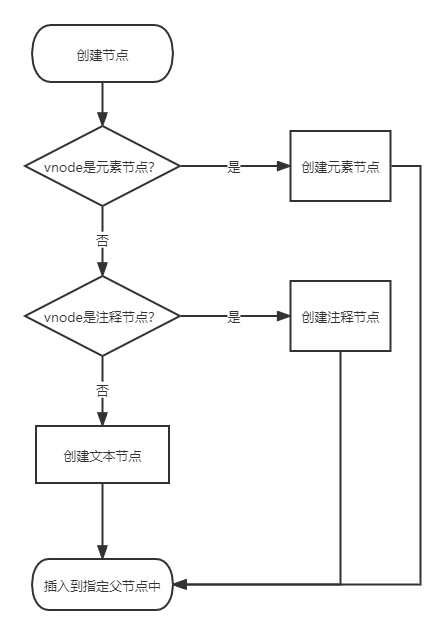
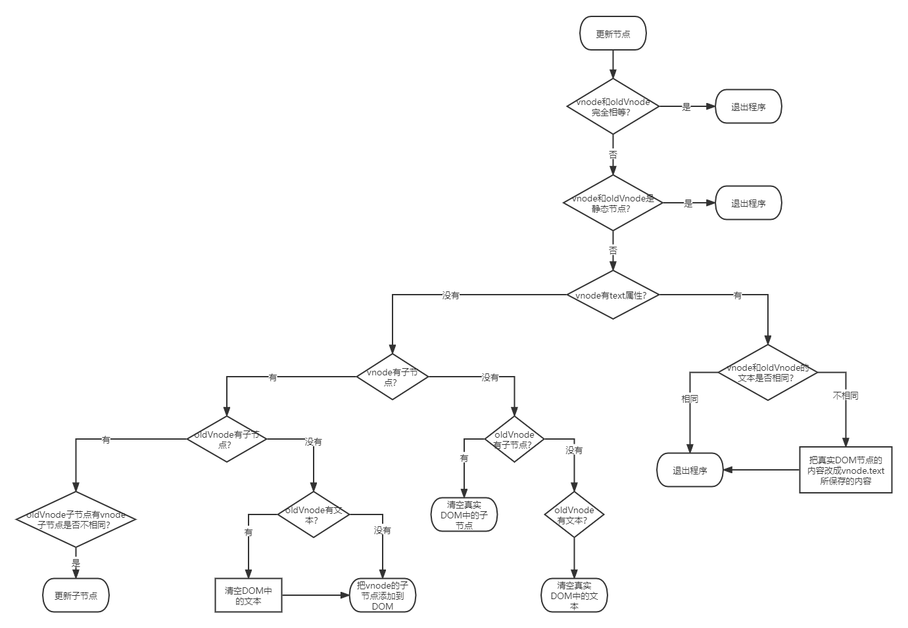

# Vue 源码之虚拟 DOM

## 前言

这是 `Vue.js` 的源码分析，记录自己在学习源码时的心得和收获。

`Vue.js` 的源码目录结构如下：
```
src
├── compiler        # 编译相关 
├── core            # 核心代码 
├── platforms       # 不同平台的支持
├── server          # 服务端渲染
├── sfc             # .vue 文件解析
├── shared          # 共享代码
```

重点关注 `core` 文件夹下面的代码文件，因为这是 `Vue.js` 的核心代码。

## VNode

### VNode 是什么

VNode 可以理解成节点描述对象，它描述了应该怎样去创建真实的 DOM，即 JavaScript 对象版本的 DOM 元素。

VNode 创建 DOM 并插入视图。
```
vnode (创建) => DOM (渲染) => 视图
```

### VNode 的作用

最重要的的一个作用是 VNode 更新前后的对比，这样只更新差异的节点，减少性能浪费。

### VNode 的类型

- 注释节点
- 文本节点
- 元素节点
- 组件节点
- 函数式节点
- 克隆节点

## patch

### 介绍

patch 是在现有 DOM 上进行修改来达到渲染视图的目的。对现有 DOM 进行修改需要做三件事：
- 创建新增的节点
- 删除已经废弃的节点
- 修改需要更新的节点

### 新增节点

以下这几种情况需要新增节点
- 首次渲染页面，oldVNode 不存在，所以需要使用 vnode 来渲染 DOM
- vnode 和 oldVNode 不是同一个节点，即vnode 是新节点而 oldVNode 是废弃节点

元素节点、注释节点和文本节点。整个流程如下：



### 删除节点

以 vnode 为标准，vnode 没有的节点都属于废弃的节点，应该在 DOM 中删除。

```js
// 删除一组节点
function removeVnodes(vnodes, startIdx, endIdx) {
    for (; startIdx <= endIdx; ++startIdx) {
        const ch = vnodes[startIdx]
        if (ifDef(ch)) {
            removeNode(ch.elm)
        }
    }
}

// 删除单个节点
const nodeOps = {
    removeChild(node, child) {
        node.removeChild(child)
    }
}

function removeNode(el) {
    const parent = nodeOps.parentNode(el)
    if (isDef(parent)) {
        nodeOps.removeChild(parent, el)
    }
}
```

### 更新节点

vnode 和 oldVNode 是相同节点，对它们进行更细致的比对，替换差异化的值。

所以整个 patch 运行流程是这样的，首先检测 oldVNode 是否存在，如果不存在，就使用 vnode 创建节点并插入视图。否则进入下一步判断，oldVNode 和 vnode 是否是同一个节点，如果是，就使用 patchVnode 进行更详细的比对与更新操作。否则使用 vnode 创建真实节点并插入到视图中旧节点的旁边，最后将视图中的旧节点删除。

更新节点的逻辑流程如下：



更新节点的具体实现过程如下：


### 更新子节点

#### 更新策略

1. 创建子节点

2. 更新子节点

## 参考文献

- 《深入浅出 Vue.js》刘博文·著
- [learnVue](https://github.com/answershuto/learnVue)