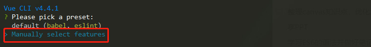
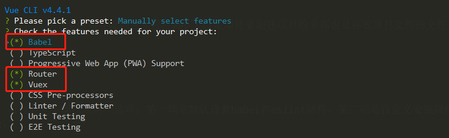
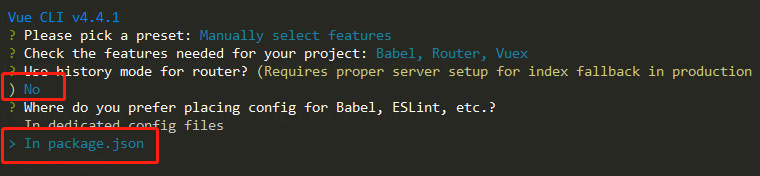
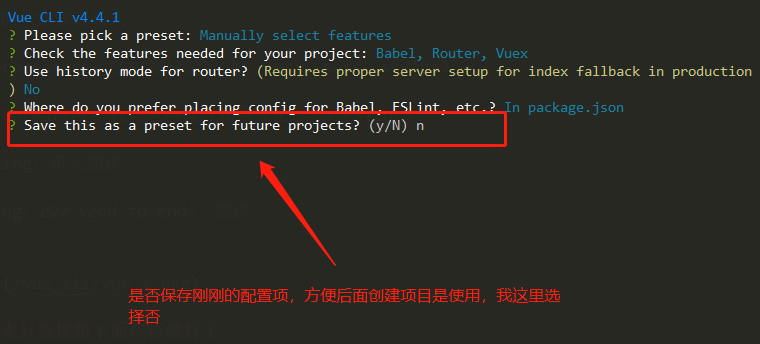

# vue-cli4.0 创建项目

## 前言

由于在工作中经常使用vue框架来开发项目，所以或多或少都有遇到一些问题。这篇文章主要总结 vue-cli4.0 创建项目的流程，和安装配置相关移动端适配插件。

创建项目开始前，默认系统已经安装好了[node.js](https://nodejs.org/zh-cn/)，[webpack](https://webpack.docschina.org/)，[vue-cli](https://cli.vuejs.org/zh/guide/installation.html)，在国内可能会遇到网络问题，安装淘宝源镜像和[mirror-config-china](https://www.npmjs.com/package/mirror-config-china)插件解决。

## 准备工作

```sh
# node.js 版本号：v12.13.0
node -v

# npm 版本号：6.10.0
npm -v

# vue-cli 版本号：@vue/cli 4.4.0
vue -V

# 安装淘宝镜像
npm install -g cnpm --registry=https://registry.npm.taobao.org

# 安装 mirror-config-china
npm i -g mirror-config-china --registry=https://registry.npm.taobao.org
```

## 构建项目

#### 打开命令行工具，执行下面语句开始创建项目：app_cli是即将要创建项目的名称也是存放项目文件的文件夹名称

```sh
vue create app_cli
```

#### 运行后，可以看到下面出现两个选项，第一项是默认设置babel和eslint插件，第二项是自定义安装插件，我选择了第二项。



#### 选项如下图，我分别选择了babel，router，vuex。

Babel：转码器，可以将ES6转成ES5代码

Typescript：TypeScript是一个JavaScript（后缀.js）的超集（后缀.ts）包含并扩展了 JavaScript 的语法，需要被编译输出为 JavaScript在浏览器运行

Progressive Web App (PWA) Support：渐进式Web应用程序

Router：vue路由

Vuex：vue的状态管理模式

CSS Pre-processors：CSS预处理器（如：less、sass、stylus）

Linter / Formatter：代码风格检查和格式化（如：ESlint）

Unit Testing：单元测试

E2E Testing：e2e（end to end） 测试




#### 接下来只要按照下面选择就好了，最后就是漫长的等待...





## 配置相关插件——lint

#### 安装eslint-plugin

> <font color=#f66>注意：</font>这里只是安装插件而已，千万不要选择官方提供的配置，因为后面会提供配置文件（如果安装成功，官方会提示你选择哪个配置方案，这时候直接退出就好）

```sh
# 有时候会安装失败
vue add eslint

# 上面安装失败，用下面这条语句，直接去图形界面搜索cli-plugin-eslint（一般排在最前面）
# 注意：进入图形界面操作时，须要选择该项目文件夹
vue ui
```
安装好cli-plugin-eslint插件后，这里准备了js，css等相关的[配置文件](https://github.com/huitoutunao/vue-lint)，将它们放在项目根目录上，接下来还要补充安装相关依赖。

```sh
# 补充安装 eslint 依赖
npm i -D eslint eslint-plugin-vue

# 安装 eslint-loader
npm i -D eslint-loader

# 安装 eslint-friendly-formatter
npm i -D eslint-friendly-formatter

# 安装 babel-eslint
npm i -D babel-eslint

# 安装 stylelint-webpack-plugin stylelint
npm i -D stylelint-webpack-plugin stylelint
```

安装好依赖后，须要对stylelint做一下配置，可以[参考文档](https://vue-loader.vuejs.org/zh/guide/linting.html#stylelint)，在根目录上创建vue.config.js文件，且在里面引入安装好的依赖，具体见下面：

```js
const StyleLintPlugin = require('stylelint-webpack-plugin')
module.exports = {
  // ... 其它选项
  plugins: [
    new StyleLintPlugin({
      files: ['**/*.{vue,htm,html,css,sss,less,scss,sass}']
    })
  ]
}
```

## 配置移动端适配插件

打开根目录的.postcssrc.js文件，可以看到那里已经写好了相关配置项，现在须要依次安装它们。
这里移动端适配使用的是vw方案，已经弃用flexible方案了。
**注意：目前 vue-cli 4 的 postcss 的版本是 7，而 postcss-import 和 postcss-url 插件需要安装兼容 7 版本的，分别是 12.0.1 和 8.0.0，可以将下面这两个命令修改为 postcss-import@12.0.1、postcss-url@8.0.0**

```sh
npm i -S postcss-import postcss-url postcss-aspect-ratio-mini postcss-write-svg postcss-cssnext postcss-px-to-viewport cssnano
```
### postcss-import

postcss-import主要功能是解决@import引入路径问题。使用这个插件，可以让你很轻易的使用本地文件、node_modules或者web_modules的文件。这个插件配合postcss-url让你引入文件变得更轻松。

### postcss-url

postcss-url插件主要用来处理文件，比如图片文件、字体文件等引用路径的处理。

### postcss-cssnext

postcss-cssnext插件可以让我们使用CSS未来的特性，其会对这些特性做相关的兼容性处理。

### cssnano

cssnano主要用来压缩和清理CSS代码，配置中使用了preset: "advanced"，所以还需要另外安装：

```sh
# 安装 cssnano-preset-advanced
npm i -D cssnano-preset-advanced
```

安装好后，在.postcssrc.js文件上配置如下：（提供的文件已经配置好了）
```js
'cssnano': {
    "cssnano-preset-advanced": {
        zindex: false,
        autoprefixer: false
    }
}
```

上面的代码把autoprefixer和postcss-zindex禁掉了。前者是有重复调用，后者是只要启用了这个插件，z-index的值就会重置为1。千万记得将postcss-zindex设置为false。

### postcss-px-to-viewport

[postcss-px-to-viewport](https://github.com/evrone/postcss-px-to-viewport)插件主要用来把px单位转换为vw、vh、vmin或者vmax这样的视窗单位，也是vw适配方案的核心插件之一。相关配置见文件注释。

在不想要把px转换为vw的时候，首先在对应的元素（html）中添加配置中指定的类名.ignore或.hairlines(.hairlines一般用于设置border-width:0.5px的元素中)：

```html
<div class="box ignore"></div>
```

编写CSS时：

```css
.ignore {
    margin: 10px; // 这里不会被编译成vw单位
    background-color: red;
}
.box {
    width: 180px;
    height: 300px;
}
.hairlines {
    border-bottom: 0.5px solid red; // 这里不会被编译成vw单位
}
```

### postcss-aspect-ratio-mini

postcss-aspect-ratio-mini主要用来处理元素容器宽高比。在实际使用的时候，具有一个默认的结构

```html
<div aspectratio>
    <div aspectratio-content></div>
</div>
```

结构定义之后，需要在你的样式文件中添加一个统一的宽度比默认属性：

```css
[aspectratio] {
  position: relative;
}

[aspectratio]::before {
  content: '';
  display: block;
  width: 1px;
  margin-left: -1px;
  height: 0;
}

[aspectratio-content] {
  position: absolute;
  top: 0;
  left: 0;
  right: 0;
  bottom: 0;
  width: 100%;
  height: 100%;
}
```

如果我们想要做一个188:246（188是容器宽度，246是容器高度）这样的比例容器，只需要这样使用：

```css
[w-188-246] {
  aspect-ratio: '188:246';
}
```

***有一点需要特别注意：aspect-ratio属性不能和其他属性写在一起，否则编译出来的属性只会留下aspect-ratio的值，比如：***

```html
<div aspectratio w-188-246 class="color"></div>
```

补充解释：主要是因为在插件中做了相应的处理，不在每次调用aspect-ratio时，生成前面指定的默认样式代码，这样代码没那么冗余。所以在使用的时候，需要把width和background-color分开来写：

```css
[w-188-246] {
  width: 188px;
  background-color: red;
}

[w-188-246] {
  aspect-ratio: '188:246';
}
```

### postcss-write-svg

postcss-write-svg 插件主要用来处理移动端 1px 的解决方案。该插件主要使用的是 border-image 和 background 来做 1px 的相关处理。比如：

```css
@svg 1px-border {
  height: 2px;
  @rect {
    fill: var(--color, black);
    width: 100%;
    height: 50%;
    }
}

.example {
  border: 1px solid transparent;
  border-image: svg(1px-border param(--color #00b1ff)) 2 2 stretch;
}
```

编译 CSS 后：

```css
.example {
    border: 1px solid transparent;
    border-image: url("data:image/svg+xml;charset=utf-8,%3Csvg xmlns='http://www.w3.org/2000/svg' height='2px'%3E%3Crect fill='%2300b1ff' width='100%25' height='50%25'/%3E%3C/svg%3E") 2 2 stretch;
}
```

上面演示的是使用 ***border-image*** 方式，除此之外还可以使用 ***background-image*** 来实现。比如：

```css
@svg square {
  @rect {
    fill: var(--color, black);
    width: 100%;
    height: 100%;
    }
}

#example {
  background: white svg(square param(--color #00b1ff)) repeat-x left bottom;
  background-size: 100% 1px;
}
```

>  ***声明：*** 由于有一些低端机对border-image支持度不够友好，个人建议你使用background-image的这个方案。

## 配置 vw 兼容 vant 组件

如果你的设计稿是 750px，那么 vw 方案兼容 vant 组件需要配置这个插件 [postcss-design-convert](https://www.npmjs.com/package/postcss-design-convert)

```js
// .postcssrc.js
module.exports = {
    plugins: {
      'postcss-design-convert': {
            multiple: 2,
            units: ['vw'],
            selector: /^\.van-/  // 样式选择器 van 开头
            // /^\.design-|^\.van-/ 可以添加多个
        }
    }
}
```

## 结尾

#### 全部安装好后，现在可以运行一下项目，由于代码检查工具的影响，所以会出现一些警告，须要根据提示修改相关代码的格式，最后就可以正常运行啦！全文到这里就结束了，文中的内容参考[大漠老师的文章](https://www.w3cplus.com/mobile/vw-layout-in-vue.html?expire=1590422647&code=nsWfZflKYwA&sign=cd9b42d6c35ee0e7a57cd62d280ee59a#paywall)。


