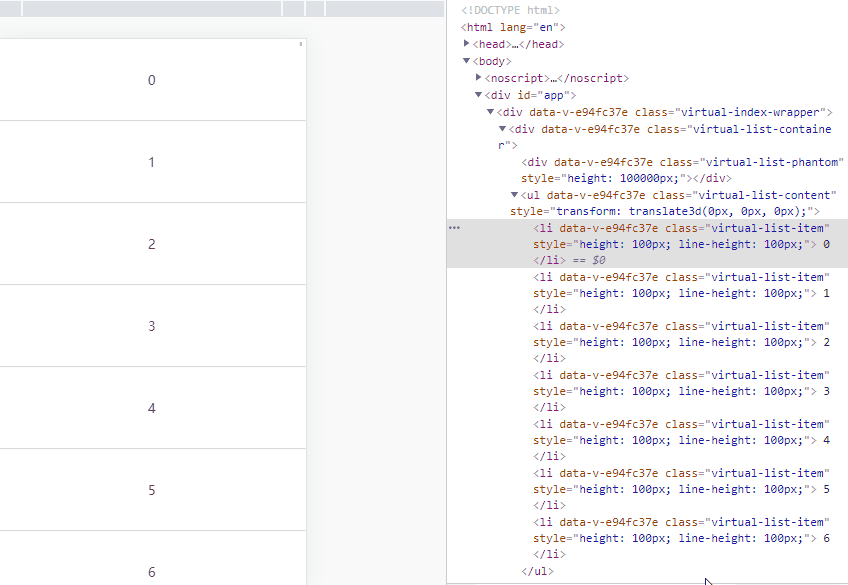

# 虚拟列表

## 前言

在移动端的项目开发中，我们应该都有处理过类似新闻列表的数据加载，为了能够快速展现列表，我们应该尽可能的减少 DOM 节点的渲染，因此我往往会和后端接口协调一致，通过前端传递页码进行分页请求数据加载。不过这种处理方式的弊端也显而易见，因为用户每次滚动到底部都先去请求数据接口，然后再进行页面渲染，这里的 http 请求耗时会影响到用户体验，所以为了减少 http 请求，我们来学习一种优化方案：虚拟列表。

## 什么是虚拟列表

虚拟列表是指将可见区域的列表进行渲染，而对不可见区域的数据不渲染或部分渲染的技术，目的是为了提高渲染性能和用户体验。


## 实现

虚拟列表的实现，就是只加载可视区域内需要的列表项，当滚动发生时，动态通过计算获得可视区域内的列表项，并将非可视区域内存在的列表项删除。

根据虚拟列表的概念描述，我们可以提炼出几个关键点：

- 可视区域的高度，假设它是固定高度。
- 列表项的高度，假设它是固定高度。
- 总列表。
- 监听滚动偏移量。
- 删除非可视区域的列表项，那么需要知道总列表的起始位置项和结束位置项。

我是使用 vue 官方脚手架初始化的模板，下面请看第一版实现：
```vue
<template>
    <div class="virtual-index-wrapper">
        <div
            ref="list"
            class="virtual-list-container"
            @scroll="onScroll($event)"
        >
            <div
                :style="{ height: listHeight + 'px' }"
                class="virtual-list-phantom"
            ></div>
            <ul
                :style="{ transform: getTransform }"
                class="virtual-list-content"
            >
                <li
                    v-for="item in visibleData"
                    :key="item.id"
                    :style="{ height: itemSize + 'px', lineHeight: itemSize + 'px' }"
                    class="virtual-list-item"
                >
                    {{ item.val }}
                </li>
            </ul>
        </div>
    </div>
</template>

<script>
    let _arr = []
    for (let i = 0; i < 1000; i++) {
        _arr.push({
            id: i,
            val: i
        })
    }

    export default {
        name: 'VirtualIndex',
        data () {
            return {
                listData: _arr, // 总列表
                itemSize: 100, // 每项的高度
                screenHeight: 0, // 可视区域高度
                startOffset: 0, // 偏移量
                start: 0, // 起始索引
                end: 0, // 结束索引
            }
        },
        computed: {
            // 列表总高度
            listHeight () {
                return this.listData.length * this.itemSize
            },

            // 可显示的列表项数
            visibleCount () {
                return Math.ceil(this.screenHeight / this.itemSize)
            },

            // 真实列表数
            visibleData () {
                return this.listData.slice(this.start, Math.min(this.end, this.listData.length))
            },

            // 偏移量对应的 style，这个是相对 virtual-list-container 作偏移，始终显示在可视区域
            getTransform () {
                return `translate3d(0, ${this.startOffset}px, 0)`
            }
        },
        mounted () {
            this.screenHeight = this.$el.clientHeight
            this.end = this.start + this.visibleCount
        },
        methods: {
            onScroll () {
                // 当前滚动位置
                let scrollTop = this.$refs.list.scrollTop

                // 此时的开始索引
                this.start = Math.floor(scrollTop / this.itemSize)

                // 此时的结束索引
                this.end = this.start + this.visibleCount

                // 此时的偏移量
                this.startOffset = scrollTop - (scrollTop % this.itemSize)
            }
        }
    }
</script>

<style lang="scss" scoped>
    .virtual-index-wrapper {
        position: relative;
        height: 100vh;
    }
    .virtual-list {
        &-container {
            position: relative;
            height: 100%;
            overflow: auto;
            -webkit-overflow-scrolling: touch;
        }
        &-phantom {
            position: absolute;
            left: 0;
            top: 0;
            right: 0;
            z-index: -1;
        }
        &-content {
            position: absolute;
            top: 0;
            left: 0;
            right: 0;
            text-align: center;
        }
        &-item {
            padding: 0 20px;
            color: #333;
            font-size: 32px;
            box-sizing: border-box;
            border-bottom: 1px solid #ccc;
        }
    }
</style>
```

效果图如下：



## 列表内容动态变化

在我们实际开发中，列表的内容高度可不像上面介绍那样是固定的，所以我们接下来要解决这个问题。

思路：以预估高度先行渲染，然后计算真实高度缓存起来。

- 给列表每一项预设固定高度，接着初始计算它们的位置。
- 渲染后根据它们的真实高度，更新它们缓存的位置信息。
- 滚动高度，计算可视区域显示列表的项数。

下面的代码片段，我已用注释说明了：

安装下依赖 [faker](https://www.npmjs.com/package/faker)，为了帮助我们生成随机内容。
```vue
<template>
    <div class="virtual-improve-wrapper">
        <div
            ref="vList"
            class="virtual-list-container"
            @scroll="onScroll($event)"
        >
            <div
                ref="vPhantom"
                class="virtual-list-phantom"
            ></div>
            <ul
                ref="vContent"
                class="virtual-list-content"
            >
                <li
                    v-for="(item, index) in visibleData"
                    :id="item.id"
                    ref="vItem"
                    :key="index"
                    class="virtual-list-item"
                >
                    {{ item.id }}、{{ item.val }}
                </li>
            </ul>
        </div>
    </div>
</template>

<style lang="scss" scoped>
    .virtual-improve-wrapper {
        position: relative;
        height: 100vh;
    }
    .virtual-list {
        &-container {
            position: relative;
            height: 100%;
            overflow: auto;
            -webkit-overflow-scrolling: touch;
        }
        &-phantom {
            position: absolute;
            left: 0;
            top: 0;
            right: 0;
            z-index: -1;
        }
        &-content {
            position: absolute;
            top: 0;
            left: 0;
            right: 0;
        }
        &-item {
            padding: 20px;
            color: #333;
            font-size: 32px;
            box-sizing: border-box;
            border-bottom: 1px solid #ccc;
        }
    }
</style>
```

## 参考文献

- [高性能渲染十万条数据(虚拟列表)](https://juejin.cn/post/6844903982742110216#heading-0)
- [文章1](https://github.com/dwqs/blog/issues/70)
- [文章2-中文](https://juejin.cn/post/6937939870018961439)
- [文章2-英文](https://betterprogramming.pub/how-to-create-smooth-endless-scrolling-in-vue-js-4fc9180645ef)
- [组件库1](https://github.com/Akryum/vue-virtual-scroller)
- [组件库2](https://github.com/tangbc/vue-virtual-scroll-list)