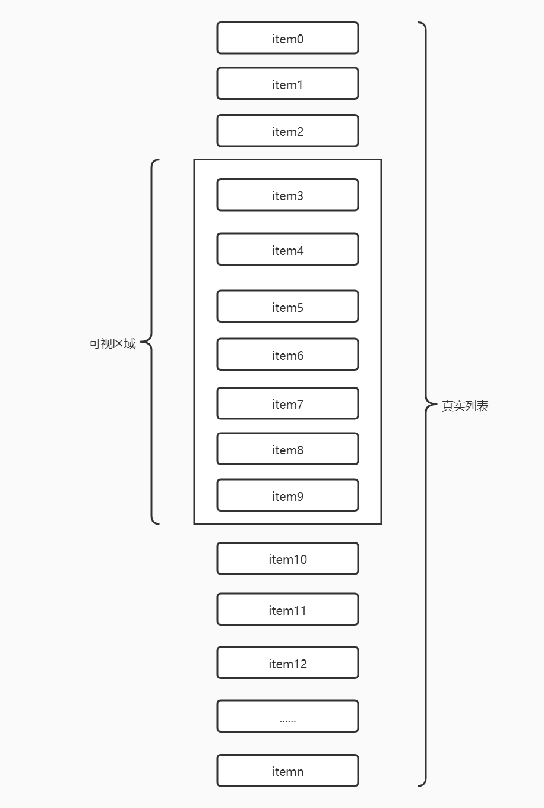

# 虚拟列表

## 前言

在移动端的项目开发中，我们应该都有处理过类似新闻列表的数据加载，为了能够快速展现列表，我们应该尽可能的减少 DOM 节点的渲染，因此我往往会和后端接口协调一致，通过前端传递页码进行分页请求数据加载。不过这种处理方式的弊端也显而易见，因为用户每次滚动到底部都先去请求数据接口，然后再进行页面渲染，这里的 http 请求耗时会影响到用户体验，所以为了减少 http 请求，我们来学习一种优化方案：虚拟列表。

## 什么是虚拟列表

虚拟列表是指将可见区域的列表进行渲染，而对不可见区域的数据不渲染或部分渲染的技术，目的是为了提高渲染性能和用户体验。



## 实现

虚拟列表的实现，就是只加载可视区域内需要的列表项，当滚动发生时，动态通过计算获得可视区域内的列表项，并将非可视区域内存在的列表项删除。

根据虚拟列表的概念描述，我们可以提炼出几个关键点：

- 可视区域的高度，假设它是固定高度。
- 列表项的高度，假设它是固定高度。
- 总列表。
- 监听滚动偏移量。
- 删除非可视区域的列表项，那么需要知道总列表的起始位置项和结束位置项。

我是使用 vue 官方脚手架初始化的模板，下面请看第一版实现：
```vue
<template>
    <div class="virtual-index-wrapper">
        <div
            ref="list"
            class="virtual-list-container"
            @scroll="onScroll($event)"
        >
            <div
                :style="{ height: listHeight + 'px' }"
                class="virtual-list-phantom"
            ></div>
            <ul
                :style="{ transform: getTransform }"
                class="virtual-list-content"
            >
                <li
                    v-for="item in visibleData"
                    :key="item.id"
                    :style="{ height: itemSize + 'px', lineHeight: itemSize + 'px' }"
                    class="virtual-list-item"
                >
                    {{ item.val }}
                </li>
            </ul>
        </div>
    </div>
</template>
```

## 参考文献

- [高性能渲染十万条数据(虚拟列表)](https://juejin.cn/post/6844903982742110216#heading-0)
- [文章1](https://github.com/dwqs/blog/issues/70)
- [文章2-中文](https://juejin.cn/post/6937939870018961439)
- [文章2-英文](https://betterprogramming.pub/how-to-create-smooth-endless-scrolling-in-vue-js-4fc9180645ef)
- [组件库1](https://github.com/Akryum/vue-virtual-scroller)
- [组件库2](https://github.com/tangbc/vue-virtual-scroll-list)