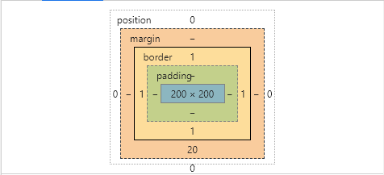
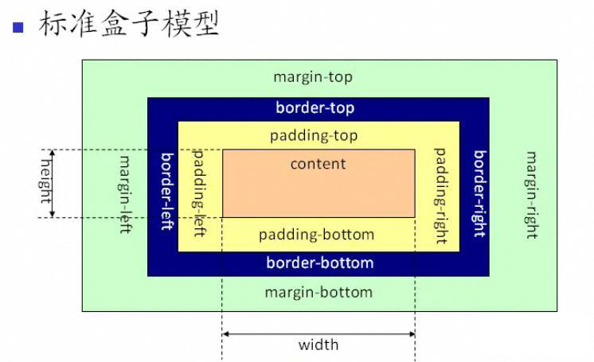

# 003-标准盒模型和 IE 盒模型的区别

## 什么是 CSS 盒模型

完整的 CSS 盒模型应用于块级盒子（Block），内联盒子（Inline）只使用盒模型中定义的部分内容。模型定义了盒的每个部分 —— margin, border, padding, and content —— 合在一起就可以创建我们在页面上看到的内容。为了增加一些额外的复杂性，有一个标准的和替代（IE）的盒模型。

```css
// 盒模型
.box {
    width: 200px;
    height: 200px;
    margin-bottom: 20px;
    border: 1px solid red;
}
```


## 标准盒模型

计算方式：  
width = 内容宽度  
height = 内容高度  



## IE 盒模型（IE6 以下）

计算方式：  
width = 内容宽度 + 左右内边距 + 左右边框  
height = 内容高度 + 上下内边距 + 上下边框  


## CSS3 切换盒模型方法

box-sizing: content-box; 标准盒模型  
box-sizing: border-box; IE 盒模型

*部分答案整理自网络资源*