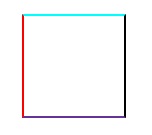
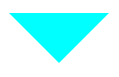
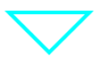

# 008-CSS 如何画一个三角形？

## 前言

在我们前端开发中，三角形也是我们遇到比较多的图案，通常使用图片或者 svg 完成效果图，因此今天我们使用纯 css 实现它。

## 实现

首先画一个矩形，然后给它添加四条边框，如下：
```html
<div class="box"></div>
```
```scss
.box {
  width: 100px;
  height: 100px;
  border-style: solid;
  border-width: 2px;
  border-top-color: #0ff;
  border-right-color: #000;
  border-bottom-color: #639;
  border-left-color: #f00;
}
```
效果图如下：



我们把 `border-width` 设置 `50px` 后效果图如下：


上图中心区域则为 `width` 和 `height`，如果把它们的值设置为 `0`，那么就得到下面效果图：


此时我们可以看到，这个矩形是由四个三角形组成的。如果只想要上方的浅蓝色的三角形，那么把左、下、右的边框设置为 0 即可，虽然这种做法可以实现，但是隐藏的部分内容依然占据着高度。因此需要将下方的宽度去掉。

最终实现代码如下：
```scss
.box {
  width: 0;
  height: 0;
  border-color: #0ff transparent transparent;
  border-style: solid;
  border-width: 50px 50px 0;
}
```

效果图如下：



如果需要制作一个空心的三角形，那么就使用一个伪元素构造出白色的三角形叠加在原三角形上面。实现代码如下：
```scss
.box {
  position: relative;
  width: 0;
  height: 0;
  border-color: #0ff transparent transparent;
  border-style: solid;
  border-width: 50px 50px 0;

  &::after {
    position: absolute;
    top: -46px;
    left: -40px;
    content: '';
    border-color: #fff transparent transparent;
    border-style: solid;
    border-width: 40px 40px 0;
  }
}
```

效果图如下：



*部分答案整理自网络资源*