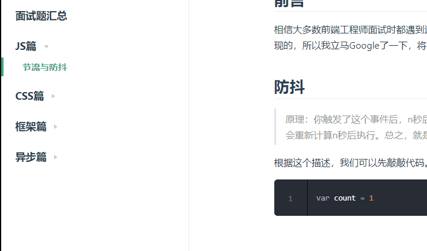

# 节流与防抖

## 前言

相信大多数前端工程师面试时都遇到过这道题吧。虽然我对这两货的概念是有了，但是不知道具体如何实现的，所以我立马Google了一下，将它记录在这里与大家共勉！

## 防抖

> 原理：你触发了这个事件后，n秒后才会执行。如果你在这个事件触发的n秒内，又再次触发，那么它会重新计算n秒后执行。总之，就是不让你频繁的触发事件执行回调。

根据这个描述，我们可以先敲敲代码。

```js
var count = 1
```

